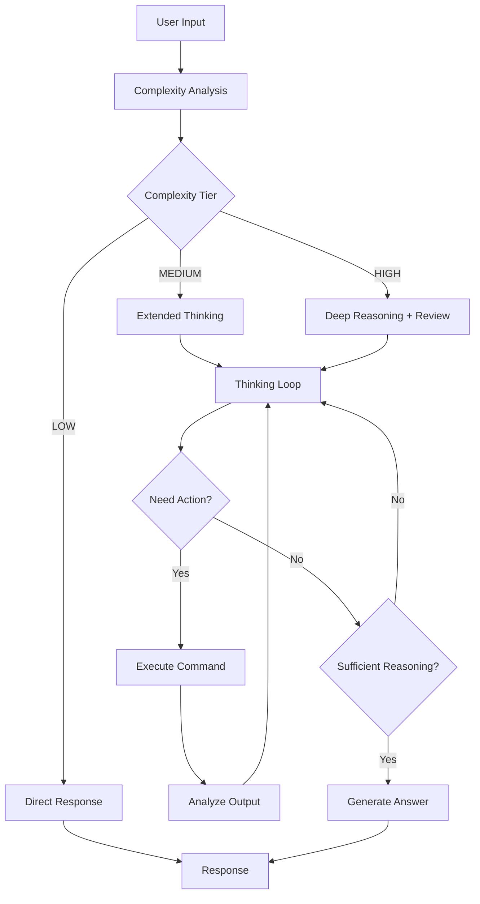
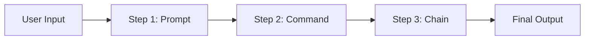

# AGiXT Core Concepts

AGiXT provides a unified AI agent platform with intelligent reasoning, context-aware memory, and extensible command execution. All interactions flow through a single, powerful inference pipeline that automatically adapts to task complexity.

## The Thinking/Acting Loop

At the heart of AGiXT is an intelligent thinking/acting loop that handles all interactions. Instead of choosing between different "modes," the agent automatically:

1. **Analyzes** the task complexity
2. **Thinks** through the problem with structured reasoning
3. **Acts** by executing commands when needed
4. **Reflects** on results and adjusts approach
5. **Responds** with a well-reasoned answer

This loop continues until the task is complete, with the agent self-correcting and adapting based on command outputs and intermediate results.

### How It Works



### Structured Reasoning Tags

The agent uses XML tags to structure its reasoning process:

| Tag | Purpose |
|-----|---------|
| `<thinking>` | Internal reasoning and analysis |
| `<reflection>` | Self-evaluation and course correction |
| `<execute>` | Command execution blocks |
| `<output>` | Results from commands (injected by system) |
| `<answer>` | Final user-facing response |
| `<speak>` | Text for voice output (TTS mode) |

### Example Interaction

```xml
<thinking>
The user wants to analyze sales data. I should first check what files are available.
</thinking>

<execute>
<name>List Files</name>
<directory>./data</directory>
</execute>

<output>
sales_2024.csv
customers.csv
</output>

<thinking>
Found the sales data. Now I'll read and analyze the key metrics.
</thinking>

<execute>
<name>Read File</name>
<filename>./data/sales_2024.csv</filename>
</execute>

<output>
date,product,revenue
2024-01-01,Widget A,1500
2024-01-02,Widget B,2300
...
</output>

<reflection>
I have the data. The user likely wants a summary of performance.
Let me calculate totals and identify trends.
</reflection>

<answer>
Based on your sales data, here's what I found:
- Total revenue: $45,000
- Top product: Widget B (40% of sales)
- Growth trend: 15% month-over-month increase
</answer>
```

## Chat Conversations

Chat is the primary interaction mode - a natural conversation where the agent has full access to its capabilities:

- **Memory Integration**: Retrieves relevant context from trained data and conversation history
- **Command Execution**: Automatically uses enabled commands when helpful
- **Multi-Turn Context**: Maintains conversation state across messages
- **Adaptive Reasoning**: Applies appropriate thinking depth based on query complexity

All chat interactions flow through the `/v1/chat/completions` endpoint with full streaming support.

## Instructions

Instructions are direct commands for immediate execution. Unlike chat, instructions are typically single-turn and action-focused:

```
"Create a backup of all Python files in the project directory"
```

The agent will:
1. Parse the instruction
2. Plan the necessary steps
3. Execute commands to accomplish the task
4. Report the results

Instructions use the same underlying pipeline as chat, but are optimized for task completion rather than conversation. To learn more about the commands available, refer to [Extension Commands](05-Extension%20Commands.md).

## Chains

Chains are predefined workflows that orchestrate multiple steps:



Each step can:
- Run a **prompt template** with the agent
- Execute a **command** from extensions
- Call another **chain** (nested workflows)

Chains are useful for:
- Repeatable business processes
- Complex multi-stage workflows
- Standardized data processing pipelines

The output of one step becomes the input for the next, allowing you to create complex workflows where the AI performs a series of actions in a specific order. See [Chains](07-Chains.md) for detailed documentation.

## Task Planning

For complex objectives, the agent automatically generates a task plan:

```xml
<thinking>
This is a multi-step task. Let me create a plan:

1. Research the topic using web search
2. Gather relevant data from files
3. Analyze the information
4. Generate the report
5. Save to the specified location
</thinking>
```

The agent tracks progress through each step, adjusting the plan based on:
- Command execution results
- New information discovered
- Errors or obstacles encountered

## Memory & Context

AGiXT uses vector-based memory to provide relevant context during every interaction.

### Memory Injection

During prompt processing (`format_prompt` in `Interactions.py`), the system:

1. **Queries memories** based on user input similarity
2. **Retrieves** top matching results (configurable limit)
3. **Injects** relevant context into the prompt
4. **Includes** recent conversation history and activities

```python
# Memory retrieval during prompt formatting
context = await agent_memory.get_memories(
    user_input=user_input,
    limit=top_results,
    min_relevance_score=0.2,
)
```

### Memory Sources

| Source | Description |
|--------|-------------|
| Agent Training | Documents, websites, files learned by the agent |
| Conversation History | Recent messages and activities |
| Company Memories | Shared knowledge across organization |
| Collection-Specific | Targeted memory collections per conversation |

### Context Assembly

The system assembles context from multiple sources during `format_prompt`:

1. **Vector memory search results** - Semantically similar content from training
2. **Additional collection memories** - From specified memory collections
3. **Conversation context** - Websearch results and conversation-specific data
4. **Recent conversation messages** - Last N messages with timestamps
5. **Agent activities** - Recent subactivities and their outcomes
6. **Uploaded file contents** - Data from user file uploads
7. **Vision analysis** - Descriptions from image processing
8. **Company training data** - Organization-specific guidelines
9. **Persona information** - Agent personality and role guidelines

## Complexity-Based Routing

The system automatically determines appropriate processing based on task complexity:

| Tier | Score | Behavior |
|------|-------|----------|
| **LOW** | 0-4 | Quick response, minimal reasoning |
| **MEDIUM** | 5-9 | Extended thinking, 8 step budget |
| **HIGH** | 10+ | Deep reasoning, answer review, smartest model |

Complexity factors include:
- Code generation requirements (+4)
- Mathematical operations (+4)
- Complex terminal commands (+3)
- Input length (tokens / 2000)
- Multi-step task indicators

See [Chat Completions](04-Chat%20Completions.md) for detailed complexity documentation.

## Commands & Extensions

Commands extend agent capabilities through modular extensions:

### Server-Side Commands

Execute on the AGiXT server:
- File operations
- Database queries
- API integrations
- Web automation

### Client-Side Commands

Execute on the user's device:
- Terminal commands (via CLI)
- Hardware control (via ESP32/IoT)
- Local system operations

### Enabling Commands

Commands are enabled per-agent to maintain focus and prevent hallucinations:

```python
# Enable specific commands for an agent
agixt.update_agent_commands(
    agent_name="XT",
    commands={
        "Search Files": True,
        "Web Search": True,
        "Execute Shell": False,  # Disabled for safety
    }
)
```

See [Extension Commands](05-Extension%20Commands.md) and [Extensions](11-Extensions.md) for details.

## Multi-Modal Input

The chat completions endpoint accepts multiple content types:

| Type | Description |
|------|-------------|
| `text` | Plain text messages |
| `image_url` | Images for vision analysis |
| `audio_url` | Audio for transcription |
| `file_url` | Documents for ingestion |

All inputs are processed and integrated into the conversation context before the thinking/acting loop begins.

## Key Principles

1. **Single Pipeline**: All interactions use the same intelligent inference pipeline
2. **Adaptive Reasoning**: Thinking depth adjusts automatically to task complexity
3. **Context-Aware**: Memory and history inform every response
4. **Self-Correcting**: The agent learns from command outputs and adjusts approach
5. **Extensible**: New capabilities added through extensions without core changes

## Further Reading

- [Chat Completions](04-Chat%20Completions.md) - Detailed endpoint documentation
- [Agents](03-Agents.md) - Agent configuration and management
- [Providers](02-Providers.md) - AI provider configuration
- [Extension Commands](05-Extension%20Commands.md) - Available commands
- [Chains](07-Chains.md) - Workflow automation
