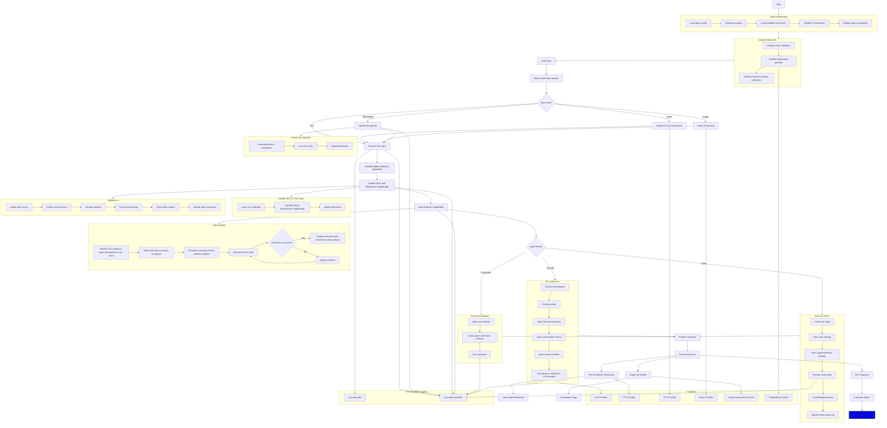

# AGiXT Chat Completions

The AGiXT Chat Completions endpoint matches the behavior of the OpenAI Chat Completions API, but with additional features and functionality based on running prompt templates, commands, and chains according to the agent's settings and `mode`.

## Overview

AGiXT is an AI agent orchestration framework that provides a chat completions workflow similar to OpenAI's Chat Completions API, but with enhanced capabilities. The system can handle various input types, process files, perform data analysis, and execute different modes of operation.

## Workflow Stages

### 1. Initialization

- Load agent configuration
- Initialize providers (LLM, TTS, STT, Vision, Image Generation, Embedding)
- Load available commands
- Initialize conversation and agent workspace
- Set up vector database and memory collections

### 2. User Input Handling

- Process multi-modal inputs (text, voice, images, file uploads)
- Log inputs and agent activities

### 3. Input Processing

- Override agent settings if applicable
- Handle URLs and web searches
- Perform data analysis for uploaded files

### 4. Agent Mode Execution

- Execute based on the agent's `mode` setting (prompt, command, or chain)

### 5. Response Generation

- Prepare and format the response
- Calculate tokens
- Log the final response

## Agent Modes

The agent `mode` changes the behavior of the chat completions endpoint when interacting with the agent:

### 1. Prompt Mode

- Executes a designated prompt template
- Requires `prompt_name` and `prompt_category` in agent settings
- Uses `user_input` variable to inject the user's message

### 2. Command Mode

- Executes a specific command
- Requires `command_name`, `command_args`, and `command_variable` in settings
- Injects message content into the specified command variable

### 3. Chain Mode

- Executes a predefined chain of actions
- Requires `chain_name` and `chain_args` in settings
- Injects message content into `user_input` for the chain

If no mode is defined, the chat completions endpoint will use the `Chat` prompt template.

## File Handling and Data Analysis

AGiXT has advanced capabilities for handling various file types and performing data analysis:

- Supports multiple file types: CSV, PDF, ZIP, Excel (XLSX, XLS), Word (DOC, DOCX), audio files, and images
- CSV file analysis:
  - Detects and analyzes CSV files in the conversation workspace
  - Handles multiple CSV files if present
  - Uses a Code Interpreter to generate Python code for data analysis
  - Verifies and executes the generated code
  - Can fix code if execution fails
- Other file types:
  - PDFs: Content extraction
  - ZIP: File extraction and recursive processing of contained files
  - Excel: Conversion to CSV for analysis
  - Word: Text extraction
  - Audio: Transcription
  - Images: Analysis using the Vision system (if available)

## Additional Features

- Text-to-Speech conversion for voice responses
- Image generation
- Web searching and link browsing
- YouTube caption reading
- GitHub repository handling (downloading and processing repo contents)
- Vision model processing for image inputs

## Usage Example and Field Descriptions

To use the `openai` Python package to interact with AGiXT agents, you can use the following code snippet:

```python
import openai

openai.base_url = "http://localhost:7437/v1/"
openai.api_key = "Your AGiXT API Key"
openai.api_type = "openai"

response = openai.chat.completions.create(
    model="AgentName",
    messages=[
        {
            "role": "user",
            "create_image": "true",
            "context_results": 5,
            "websearch": False,
            "websearch_depth": 0,
            "browse_links": True,
            "content": [
                {"type": "text", "text": "What can you tell me about this image of a cat?"},
                {
                    "type": "image_url",
                    "file_name": "funny_cat.jpg",
                    "image_url": {
                        "url": "https://example.com/funny_cat.jpg"
                    },
                },
                {
                    "type": "text_url",
                    "file_name": "agixt_info.txt",
                    "text_url": {
                        "url": "https://agixt.com"
                    },
                    "collection_number": "0", # Save to collection 0 instead of the conversational memories
                },
                {
                    "type": "application_url",
                    "file_name": "research_paper.pdf",
                    "application_url": {
                        "url": "data:application/pdf;base64,base64_encoded_pdf_here"
                    },
                },
                {
                    "type": "file_url",
                    "file_name": "research_paper.pdf",
                    "file_url": {
                        "url": "data:application/pdf;base64,base64_encoded_pdf_here"
                    },
                },
                {
                    "type": "audio_url",
                    "audio_url": {
                        "url": "data:audio/wav;base64,base64_encoded_audio_here"
                    },
                },
            ],
        },
    ],
    max_tokens=4096,
    temperature=0.7,
    top_p=0.9,
    user="Conversation Name",
)
print(response.choices[0].message.content)
```

### Field Descriptions

- `model`: The name of the AGiXT agent you want to interact with.
- `user`: The conversation name you want to use. This helps maintain context across multiple interactions.
- `create_image`: Set to "true" to generate an image using the agent's designated image provider and send it with the response.
- `context_results`: The number of relevant memories to inject into the conversation. Default is 5 if not set.
- `websearch`: Set to `True` to enable web search, `False` to disable. Default is `False` if not set.
- `websearch_depth`: The depth of web search to perform. A value of 3 would go 3 links deep per scraped link.
- `browse_links`: Set to `True` to make the agent scrape any web URLs the user puts in the chat.

### Content Types

The `content` field can include various types of input:

1. `text`: Plain text input from the user.
2. `image_url`: An image to be processed by the vision model.
   - `file_name`: Optional. Defaults to a random name if not provided.
   - `image_url`: The URL of the image to be downloaded and processed.

3. `text_url` or `url`: Text content or a URL to be scraped.
   - `file_name`: Optional. Defaults to a random name if not provided.
   - `text_url`: The content or URL of the text to be processed.
   - `collection_number`: Optional. Defaults to 0.

4. `application_url`: For uploading files (e.g., PDFs).
   - `file_name`: Optional. Defaults to a random name if not provided.
   - `application_url`: The URL or base64-encoded content of the file.
   - `collection_number`: Optional. Defaults to 0.

5. `audio_url`: For audio input to be transcribed.
   - `audio_url`: The URL or base64-encoded content of the audio file.

### Additional Notes

- If files are uploaded to the chat completions endpoint, they will be stored in the agent's memory and can be referenced by the agent's prompt templates, commands, and chains.
- GitHub repositories can be read if a GitHub URL is provided and `browse_links` is enabled.
- YouTube captions can be read if a YouTube video link is given and `browse_links` is enabled.
- When passing images, they are sent to the vision model first, and the vision model's response is passed in context to the LLM model.

## Key Points

- The workflow is flexible and can handle various input types and processing modes
- It integrates multiple AI capabilities (LLM, vision, speech, data analysis, etc.) in a single framework
- The system maintains a memory of conversations and can inject relevant context
- Users can customize the agent's behavior through settings and mode selection
- The chat completions endpoint (/v1/chat/completions) mimics the OpenAI API for ease of use
- Advanced file handling and data analysis capabilities make it suitable for complex data-driven tasks

This comprehensive system allows for highly customizable and feature-rich AI interactions, capable of handling complex tasks and multimodal inputs while maintaining a simple interface for users and developers.

## Workflow Diagram


