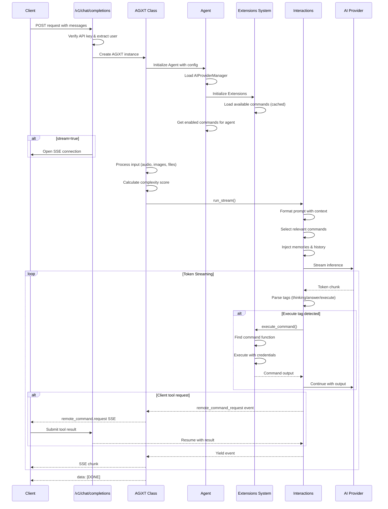
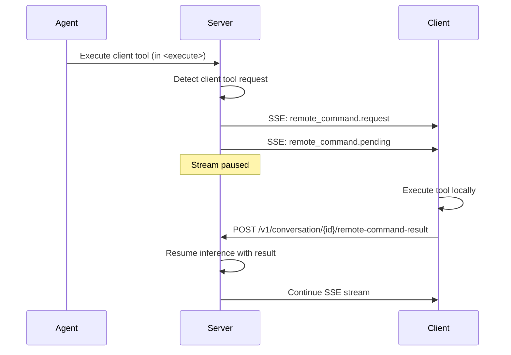
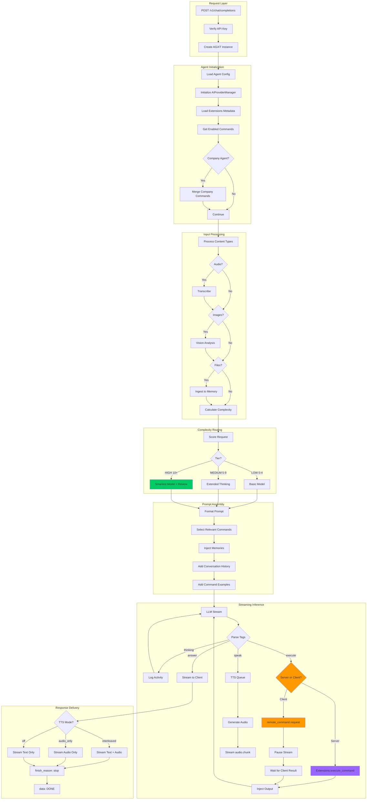

# AGiXT Chat Completions

The AGiXT Chat Completions endpoint (`/v1/chat/completions`) provides an OpenAI-compatible API with advanced streaming capabilities, intelligent model routing, structured reasoning processes, and client-side command execution.

## Overview

AGiXT's chat completions system goes far beyond simple request/response interactions. It features:

- **SSE (Server-Sent Events) Streaming** - Real-time token-by-token response delivery
- **Structured Thinking Process** - Visible reasoning with `<thinking>`, `<reflection>`, and `<answer>` tags
- **Complexity-Based Model Routing** - Automatic selection of appropriate models based on task complexity
- **Extensions System** - Modular server-side commands that can be enabled per-agent
- **Client-Side Command Execution** - Remote tool execution on client devices (CLI, ESP32, etc.)
- **Automatic Context Management** - Intelligent context reduction to prevent token limit issues
- **Multi-Modal Input Support** - Text, audio, images, and file uploads in a single request
- **Real-Time TTS Streaming** - Sentence-by-sentence audio generation during response streaming

## Complete Endpoint Pipeline

Understanding the full request flow is essential for developers integrating with or extending AGiXT. Here's the complete pipeline from HTTP request to streamed response:



### Pipeline Stages in Detail

#### 1. Request Reception (`endpoints/Completions.py`)

```python
@app.post("/v1/chat/completions")
async def chat_completion(prompt: ChatCompletions, user=Depends(verify_api_key)):
    # 1. Validate API key, extract authenticated user
    # 2. Resolve conversation (by name or UUID)
    # 3. Create AGiXT instance with agent and conversation context
    agixt = AGiXT(user=user, agent_name=prompt.model, api_key=authorization)
    
    if prompt.stream:
        return StreamingResponse(agixt.chat_completions_stream(prompt))
    else:
        return await agixt.chat_completions(prompt)
```

#### 2. Input Processing (`XT.py: chat_completions_stream()`)

- **Audio Transcription**: Transcribes any audio content to text
- **Image Processing**: Sends images through vision provider
- **File Handling**: Ingests files into agent memory or provides access instructions
- **Complexity Analysis**: Scores the request to determine model routing

#### 3. Agent Initialization (`Agent.py`)

- **Provider Management**: `AIProviderManager` configures available AI providers
- **Extensions Loading**: Loads extension metadata (cached with AST parsing for speed)
- **Command Registration**: Maps enabled commands from extensions and chains

#### 4. Prompt Formatting (`Interactions.py: format_prompt()`)

- **Memory Retrieval**: Queries vector memories based on user input
- **Context Injection**: Adds conversation history, activities, and relevant data
- **Command Selection**: Intelligently selects relevant commands for the task
- **Template Rendering**: Fills prompt template with all variables

#### 5. Streaming Inference (`Interactions.py: run_stream()`)

- **Tag Parsing**: Detects `<thinking>`, `<reflection>`, `<answer>`, `<execute>`, `<speak>` tags
- **Command Execution**: Extracts and executes commands, yields results to LLM
- **Activity Logging**: Records all steps as subactivities
- **Output Streaming**: Yields typed events for each content segment

#### 6. Response Delivery (`XT.py: _execute_chat_completions_stream()`)

- **Event Formatting**: Converts internal events to SSE format
- **TTS Generation**: Streams audio for completed sentences
- **Remote Commands**: Handles client-side tool execution flow

## Streaming Architecture

### SSE Event Format

When `stream=true`, responses are delivered as Server-Sent Events:

```
data: {"id":"conv_id","object":"chat.completion.chunk","created":1234567890,"model":"AgentName","choices":[{"index":0,"delta":{"content":"Hello"},"finish_reason":null}]}

data: {"id":"conv_id","object":"chat.completion.chunk","created":1234567890,"model":"AgentName","choices":[{"index":0,"delta":{"content":" world"},"finish_reason":null}]}

data: [DONE]
```

### SSE Object Types

The streaming response includes various object types for different content:

| Object Type | Description |
|-------------|-------------|
| `chat.completion.chunk` | Standard text response tokens |
| `chat.completion.activity` | Agent activities (thinking, tool usage, etc.) |
| `audio.header` | WAV header for TTS audio streams |
| `audio.chunk` | PCM audio data chunks |
| `audio.end` | End of audio stream marker |
| `remote_command.request` | Request for client-side command execution |
| `remote_command.pending` | Stream paused waiting for client response |

## Extensions System

Extensions provide modular functionality that agents can use through server-side commands. Each extension is a Python class that defines one or more commands.

### Extension Architecture

```
extensions/
├── agixt_actions.py      # Core AGiXT operations (chains, prompts)
├── Web_Automation.py     # Browser automation with Playwright
├── file_operations.py    # File system operations
├── database.py           # SQL database access
├── Microsoft365.py       # Office 365 integration
└── custom_extension.py   # User-defined extensions
```

### Extension Loading (Lazy Loading)

Extensions use AST parsing for metadata extraction, enabling fast startup without importing all modules:

```python
# Extensions.py - Metadata cache built via AST parsing (no imports)
_extension_metadata_cache = {
    "commands": {
        "Search Files": {
            "module_file": "extensions/file_operations.py",
            "class_name": "file_operations",
            "function_name": "search_files",
            "params": {"search_string": "str", "directory": "str"},
            "description": "Search for text within files"
        }
    },
    "extensions": {
        "file_operations": {
            "file": "extensions/file_operations.py",
            "settings": ["WORKING_DIRECTORY"],
            "commands": ["Search Files", "Read File", "Write File"],
            "friendly_name": "File Operations",
            "description": "File system operations",
            "category": "Automation"
        }
    }
}
```

Modules are only imported when commands are actually executed, significantly reducing startup time.

### Enabling Commands Per-Agent

Each agent can have different commands enabled:

```python
# Using SDK to enable commands for an agent
agixt.update_agent_commands(
    agent_name="XT",
    commands={
        "Search Files": True,
        "Write File": True,
        "Execute Shell": False,  # Disabled for security
        "Web Search": True
    }
)
```

Commands are stored in the `AgentCommand` database table, linking agents to specific commands.

### Company-Level Command Inheritance

Agents can inherit enabled commands from a company configuration:

```python
# Agent.py - Company command inheritance
def get_company_agent_extensions(self):
    agent_extensions = self.get_agent_extensions()
    if self.company_id:
        company_agent = self.get_company_agent()
        company_extensions = company_agent.get_agent_extensions()
        # Merge: if company has command enabled, enable for user agent
        for company_ext in company_extensions:
            for agent_ext in agent_extensions:
                if company_ext["extension_name"] == agent_ext["extension_name"]:
                    for company_cmd in company_ext["commands"]:
                        for agent_cmd in agent_ext["commands"]:
                            if company_cmd["friendly_name"] == agent_cmd["friendly_name"]:
                                if str(company_cmd["enabled"]).lower() == "true":
                                    agent_cmd["enabled"] = True
    return agent_extensions
```

### Extension Settings & Credentials

Extensions can require settings (like API keys) that are injected at execution time:

```python
# Extension definition with settings
class Microsoft365:
    def __init__(self, MICROSOFT_CLIENT_ID="", MICROSOFT_CLIENT_SECRET="", **kwargs):
        self.client_id = MICROSOFT_CLIENT_ID
        self.client_secret = MICROSOFT_CLIENT_SECRET
        
        self.commands = {
            "Send Email": self.send_email,
            "Read Calendar": self.read_calendar
        }
```

Settings are automatically injected from:
1. Agent settings
2. SSO credentials (for OAuth-enabled extensions)
3. User preferences

### Command Execution Flow

When the agent decides to execute a command:

```python
# Extensions.py - execute_command()
async def execute_command(self, command_name: str, command_args: dict = None):
    # 1. Gather injection variables
    credentials = get_sso_credentials(user_id=self.user_id)
    injection_variables = {
        "user": self.user,
        "agent_name": self.agent_name,
        "conversation_id": self.conversation_id,
        "ApiClient": self.ApiClient,
        **self.agent_config["settings"],
        **credentials,
    }
    
    # 2. Find the command function
    command_function, module, params = self.find_command(command_name)
    
    # 3. Execute with type conversion
    sig = signature(command_function)
    converted_args = {}
    for arg_name, arg_value in args.items():
        if arg_name in sig.parameters:
            param_info = sig.parameters[arg_name]
            converted_args[arg_name] = self._convert_arg_type(arg_value, param_info.annotation)
    
    # 4. Execute and return result
    result = await command_function(**converted_args, **injection_variables)
    return result
```

### Creating Custom Extensions

```python
# extensions/my_extension.py
class my_extension:
    """Custom extension for specialized operations."""
    
    friendly_name = "My Custom Extension"
    CATEGORY = "Custom"
    
    def __init__(self, API_KEY="", **kwargs):
        self.api_key = API_KEY
        self.commands = {
            "Custom Action": self.custom_action,
        }
    
    async def custom_action(self, param1: str, param2: int = 10) -> str:
        """
        Perform a custom action.
        
        Args:
            param1: Description of first parameter
            param2: Description of second parameter (default: 10)
        
        Returns:
            Result of the custom action
        """
        # Implementation here
        return f"Executed with {param1} and {param2}"
```

### Server-Side vs Client-Side Commands

| Type | Execution Location | Use Case |
|------|-------------------|----------|
| **Server-Side** | AGiXT server | Database queries, file ops, API calls |
| **Client-Side** | User's device | Terminal commands, hardware control |
| **Chains** | Server-Side | Multi-step workflows as single commands |

## Structured Thinking Process

AGiXT uses XML tags to structure the agent's reasoning process:

### Response Tags

- `<thinking>` - Internal reasoning and analysis (streamed as activities)
- `<reflection>` - Self-evaluation of reasoning (streamed as activities)
- `<answer>` - The final user-facing response
- `<execute>` - Command/tool execution blocks
- `<speak>` - Text designated for TTS output
- `<output>` - Results from command execution (injected by system)

### Tag Processing in the Pipeline

The `Interactions.run_stream()` method parses tags in real-time:

```python
# Simplified tag processing logic
async def run_stream(self, ...):
    async for token in llm_stream():
        response_buffer += token
        
        # Detect tag transitions
        if "<thinking>" in response_buffer:
            yield {"type": "activity", "content": thinking_content}
        
        elif "<execute>" in response_buffer and "</execute>" detected:
            # Extract command details
            command_name = extract_tag("name", execute_block)
            command_args = extract_args(execute_block)
            
            # Execute the command
            output = await self.agent.extensions.execute_command(
                command_name=command_name,
                command_args=command_args
            )
            
            # Inject output back to LLM context
            response_buffer += f"<output>\n{output}\n</output>"
            yield {"type": "output", "content": output}
            
            # Continue inference with the output
            continue
        
        elif "<answer>" in response_buffer:
            yield {"type": "answer", "content": answer_content}
```

### Example Response Flow

```xml
<thinking>
The user is asking about file operations. I should check what files exist first.
</thinking>

<execute>
<name>List Files</name>
<directory>./</directory>
</execute>

<output>
file1.txt
file2.csv
</output>

<reflection>
I found two files. The user likely wants information about these.
</reflection>

<answer>
I found 2 files in your workspace: file1.txt and file2.csv
</answer>
```

### Command Prompt Injection

When commands are enabled, the agent receives detailed execution examples:

```python
# Agent.py - get_commands_prompt()
def get_commands_prompt(self, conversation_id, running_command=None, selected_commands=None):
    """Generate the commands prompt section for the agent."""
    
    agent_commands = "## Available Commands\n\n"
    
    for extension in self.get_agent_extensions():
        enabled_commands = [cmd for cmd in extension["commands"] if cmd["enabled"]]
        if not enabled_commands:
            continue
            
        agent_commands += f"\n### {extension['extension_name']}\n"
        agent_commands += f"Description: {extension['description']}\n"
        
        for command in enabled_commands:
            agent_commands += f"\n#### {command['friendly_name']}\n"
            agent_commands += f"Description: {command['description']}\n"
            agent_commands += "Command execution format:\n"
            agent_commands += f"<execute>\n<name>{command['friendly_name']}</name>\n"
            for arg_name in command["command_args"].keys():
                agent_commands += f"<{arg_name}>value</{arg_name}>\n"
            agent_commands += "</execute>\n"
    
    return agent_commands
```

## Complexity-Based Model Routing

AGiXT automatically analyzes each request and routes to appropriate models based on task complexity.

### Complexity Scoring System

The complexity analysis happens in `Complexity.py` and scores tasks based on multiple weighted factors:

| Factor | Score Weight | Detection Method |
|--------|--------------|------------------|
| Code generation required | +4 | Keywords: code, program, script, function, class |
| Math/calculation required | +4 | Presence of equations, math operations |
| Complex terminal commands | +3 | Multi-step CLI operations |
| Input tokens per 2K | +1 | `len(tokens) / 2000` |
| Ambiguous request | +2 | Vague language detection |
| Multi-step task | Variable | Step indicators in prompt |

### Complexity Tiers

| Tier | Score Range | Thinking Budget | Behavior |
|------|-------------|-----------------|----------|
| LOW | 0-4 | 0 steps | Direct response, basic model |
| MEDIUM | 5-9 | 8 steps (min 3) | Extended reasoning |
| HIGH | 10+ | 15 steps (min 8) | Routes to smartest model, answer review enabled |

### Thinking Budget Enforcement

For MEDIUM and HIGH complexity, minimum thinking steps are enforced:

```python
# Interactions.py - Thinking budget logic
if complexity_tier == "HIGH" and thinking_steps < 8:
    # Inject intervention prompt to encourage more reasoning
    yield {"type": "intervention", "content": "Consider additional approaches..."}
    continue  # Continue inference rather than allowing premature answer
```

### Model Selection with AIProviderManager

```python
# Agent.py - AIProviderManager
class AIProviderManager:
    def __init__(self, agent_config):
        self.intelligence_tiers = ["anthropic", "google", "openai", "ezlocalai"]
        # Build provider list from agent settings
        
    def get_provider_for_service(self, service_type, use_smartest=False, tokens_required=0):
        """Select appropriate provider based on requirements."""
        
        if use_smartest:
            # Return highest-tier provider that supports the token count
            for tier in self.intelligence_tiers:
                provider = self._get_provider(tier, service_type)
                if provider and provider.max_tokens >= tokens_required:
                    return provider
        
        # Default: return smallest capable provider (cost optimization)
        return self._get_cheapest_capable_provider(service_type, tokens_required)
```

Default intelligence tier ordering: `anthropic > google > openai > ezlocalai`

## Client-Side Command Execution

AGiXT supports executing commands on client devices through the streaming interface. This enables scenarios like:

- CLI terminal commands on user's machine
- Hardware control on ESP32/embedded devices
- Custom client-side tool execution

### Client-Defined Tools vs Server Extensions

| Aspect | Client-Defined Tools | Server Extensions |
|--------|---------------------|-------------------|
| Definition | Passed in `tools` parameter | Python classes in `extensions/` |
| Execution | Client device | AGiXT server |
| Use Case | Hardware, local shell | APIs, databases |
| Result Handling | Submit via endpoint | Inline in stream |

### Remote Command Flow



### Remote Command Request Format

```json
{
    "id": "chunk_id",
    "object": "remote_command.request",
    "created": 1234567890,
    "model": "AgentName",
    "conversation_id": "conv_uuid",
    "request_id": "req_uuid",
    "tool_name": "capture_image",
    "tool_args": {
        "prompt": "Analyze what's in front of me"
    }
}
```

### Registering Client-Defined Tools

Pass tools in the request using OpenAI-compatible format:

```python
tools = [
    {
        "type": "function",
        "function": {
            "name": "capture_image",
            "description": "Capture an image using the device camera",
            "parameters": {
                "type": "object",
                "properties": {
                    "prompt": {
                        "type": "string",
                        "description": "What to analyze in the image"
                    }
                },
                "required": ["prompt"]
            }
        }
    }
]

response = openai.chat.completions.create(
    model="XT",
    messages=[{"role": "user", "content": "What do you see?"}],
    tools=tools,
    tool_choice="auto",
    stream=True
)
```

### Client Tool Processing in Pipeline

```python
# Interactions.py - Client tool handling
if command_overrides:
    for tool in command_overrides:
        if tool.get("type") == "function" and "function" in tool:
            func_def = tool["function"]
            func_name = func_def.get("name", "")
            
            # Store definition for later execution routing
            self._client_tools[func_name] = func_def
            
            # Add as pseudo-command so agent knows about it
            client_command = {
                "friendly_name": func_name,
                "name": func_name,
                "description": func_def.get("description", ""),
                "enabled": True,
                "extension_name": "__client__",  # Special marker
            }
            self.agent.available_commands.append(client_command)
```

### Exclusive Tool Mode

Tools can request exclusive access, disabling all other commands:

```python
tools = [
    {
        "type": "function",
        "exclusive": True,  # Disable all other commands
        "function": {
            "name": "capture_image",
            # ...
        }
    }
]
```

### CLI Remote Commands

The AGiXT CLI automatically handles `execute_terminal_command` for running commands on the user's machine:

```python
# CLI handles remote_command.request events
# Commands run in the user's terminal, results stream back to the agent
async for event in stream:
    if event.get("object") == "remote_command.request":
        command = event.get("command")
        result = subprocess.run(command, shell=True, capture_output=True)
        await submit_result(event["conversation_id"], event["request_id"], result.stdout)
```

### ESP32 Client Tools Example

```c
// AGiXT-ESP32 - Tool definitions
static agixt_tool_t client_tools[] = {
    {
        .name = "capture_image",
        .description = "Capture an image using the device camera",
        .handler = handle_capture_image,
        .param_count = 1,
        .params = {
            {"prompt", "string", "What to analyze", true}
        }
    },
    {
        .name = "send_ir",
        .description = "Send IR signal to control devices",
        .handler = handle_send_ir,
        .param_count = 3,
        .params = {
            {"protocol", "string", "IR protocol (NEC, Samsung32)", true},
            {"address", "string", "Device address", true},
            {"command", "string", "Command code", true}
        }
    }
};

// Handle remote command request from stream
void handle_remote_command(cJSON *request) {
    const char *tool_name = cJSON_GetStringValue(
        cJSON_GetObjectItem(request, "tool_name")
    );
    cJSON *tool_args = cJSON_GetObjectItem(request, "tool_args");
    
    // Find and execute the tool
    for (int i = 0; i < ARRAY_SIZE(client_tools); i++) {
        if (strcmp(client_tools[i].name, tool_name) == 0) {
            char *result = client_tools[i].handler(tool_args);
            submit_tool_result(request, result);
            break;
        }
    }
}
```

## Intelligent Command Selection

AGiXT intelligently selects relevant commands for each task to avoid overwhelming the LLM with unused options.

### Selection Process

```python
# Interactions.py - select_commands_for_task()
async def select_commands_for_task(self, user_input, conversation_name, ...):
    """
    Use a lightweight LLM call to determine which commands are relevant.
    
    Returns:
        list[str]: List of command friendly names to enable for this request
    """
    # Build command summary for selection prompt
    all_commands = self.agent.available_commands
    command_summary = "\n".join([
        f"- {cmd['friendly_name']}: {cmd.get('description', '')}"
        for cmd in all_commands if cmd['enabled']
    ])
    
    # Ask model which commands are relevant
    selection_response = await self.run(
        prompt_name="Select Commands",
        command_summary=command_summary,
        user_input=user_input,
        file_context=file_context,
        log_output=False
    )
    
    # Parse response to get list of selected commands
    return parse_selected_commands(selection_response)
```

### Selection Benefits

- **Reduced Token Usage**: Only inject examples for relevant commands
- **Faster Inference**: Less context for LLM to process
- **Better Accuracy**: Focused command set reduces confusion

### Client Tools Always Included

Client-defined tools bypass selection and are always available:

```python
# Interactions.py
if self._client_tools and selected_commands is not None:
    for client_tool_name in self._client_tools.keys():
        if client_tool_name not in selected_commands:
            selected_commands.append(client_tool_name)
```

## Automatic Context Management

AGiXT prevents token limit errors through intelligent context management:

### Context Reduction Strategies

1. **Memory Injection Limits** - Configurable `context_results` parameter (default: 5)
2. **Conversation Trimming** - Older messages compressed or removed when approaching limits
3. **File Handling** - Large files provide access instructions instead of full content
4. **Dynamic Token Calculation** - Real-time tracking of input token usage

### Large File Handling

When files exceed context limits, AGiXT provides command-based access:

```
The user uploaded a file called `data.csv` which is 15.2MB in size.
Since this file is too large to include in context, use the **Search Files** 
command to search for specific data patterns, or use the **Read File Lines** 
command to read specific line ranges from `data.csv`.
```

## TTS Streaming Modes

The `tts_mode` parameter controls text-to-speech behavior:

| Mode | Behavior |
|------|----------|
| `off` | No audio generation |
| `audio_only` | Generate audio, don't stream text |
| `interleaved` | Stream both text and audio simultaneously |

TTS streams sentence-by-sentence for real-time audio playback during response generation.

## Usage Examples

### Basic Streaming Request (Python SDK)

```python
from agixtsdk import AGiXTSDK

agixt = AGiXTSDK(base_uri="http://localhost:7437", api_key="your-api-key")

# Streaming chat
for chunk in agixt.chat_completions(
    agent_name="XT",
    messages=[{"role": "user", "content": "Analyze the performance of my code"}],
    stream=True
):
    if chunk.get("choices"):
        content = chunk["choices"][0].get("delta", {}).get("content", "")
        print(content, end="", flush=True)
```

### OpenAI-Compatible Request (Python openai package)

```python
import openai

openai.base_url = "http://localhost:7437/v1/"
openai.api_key = "Your AGiXT API Key"

response = openai.chat.completions.create(
    model="XT",  # Agent name
    messages=[
        {"role": "user", "content": "What files are in my workspace?"}
    ],
    stream=True,
    user="MyConversation"  # Conversation name
)

for chunk in response:
    if chunk.choices[0].delta.content:
        print(chunk.choices[0].delta.content, end="", flush=True)
```

### Multi-Modal Request with Files and Audio

```python
import openai
import base64

openai.base_url = "http://localhost:7437/v1/"
openai.api_key = "Your AGiXT API Key"

# Read and encode audio file
with open("recording.wav", "rb") as f:
    audio_b64 = base64.b64encode(f.read()).decode()

# Read and encode image
with open("screenshot.png", "rb") as f:
    image_b64 = base64.b64encode(f.read()).decode()

response = openai.chat.completions.create(
    model="XT",
    messages=[
        {
            "role": "user",
            "content": [
                {"type": "text", "text": "Analyze this image and respond to my voice message"},
                {
                    "type": "image_url",
                    "image_url": {"url": f"data:image/png;base64,{image_b64}"}
                },
                {
                    "type": "audio_url",
                    "audio_url": {"url": f"data:audio/wav;base64,{audio_b64}"}
                }
            ]
        }
    ],
    stream=True,
    user="MultiModalChat"
)
```

### Request with Client-Side Tools

```python
import openai

openai.base_url = "http://localhost:7437/v1/"
openai.api_key = "Your AGiXT API Key"

# Define tools that will execute on the client
tools = [
    {
        "type": "function",
        "function": {
            "name": "get_system_info",
            "description": "Get information about the client system",
            "parameters": {
                "type": "object",
                "properties": {
                    "info_type": {
                        "type": "string",
                        "enum": ["cpu", "memory", "disk"],
                        "description": "Type of system information to retrieve"
                    }
                },
                "required": ["info_type"]
            }
        }
    }
]

response = openai.chat.completions.create(
    model="XT",
    messages=[{"role": "user", "content": "Check my system's memory usage"}],
    tools=tools,
    tool_choice="auto",
    stream=True
)

# Handle streaming response including remote command requests
for chunk in response:
    data = chunk.model_dump()
    
    if data.get("object") == "remote_command.request":
        # Execute the tool locally
        tool_name = data.get("tool_name")
        tool_args = data.get("tool_args", {})
        
        # Execute and submit result back to the server
        result = execute_local_tool(tool_name, tool_args)
        submit_tool_result(data.get("conversation_id"), data.get("request_id"), result)
    
    elif chunk.choices and chunk.choices[0].delta.content:
        print(chunk.choices[0].delta.content, end="", flush=True)
```

## Request Parameters

### Required Parameters

| Parameter | Type | Description |
|-----------|------|-------------|
| `model` | string | Name of the AGiXT agent |
| `messages` | array | Array of message objects with `role` and `content` |

### Optional Parameters

| Parameter | Type | Default | Description |
|-----------|------|---------|-------------|
| `stream` | boolean | `false` | Enable SSE streaming |
| `user` | string | `-` | Conversation name (new conversation if `-`) |
| `temperature` | float | Agent setting | Response randomness (0.0-1.0) |
| `max_tokens` | integer | Agent setting | Maximum response tokens |
| `tools` | array | `null` | Client-side tool definitions |
| `tool_choice` | string | `auto` | Tool selection behavior |

### Message-Level Parameters

These can be included in message objects:

| Parameter | Type | Default | Description |
|-----------|------|---------|-------------|
| `context_results` | integer | `5` | Number of memories to inject |
| `websearch` | boolean | `false` | Enable web search |
| `websearch_depth` | integer | `0` | Link depth for web scraping |
| `browse_links` | boolean | `true` | Auto-scrape URLs in input |
| `tts` | boolean | `false` | Enable text-to-speech |
| `tts_mode` | string | `off` | TTS mode: `off`, `audio_only`, `interleaved` |

### Content Types

The `content` field supports multiple input types:

| Type | Description |
|------|-------------|
| `text` | Plain text input |
| `image_url` | Image for vision processing |
| `audio_url` | Audio for transcription |
| `file_url` | Generic file upload |
| `application_url` | Application files (PDF, etc.) |
| `text_url` | URL to scrape for text content |

## Handling Streaming Responses

### JavaScript/TypeScript

```typescript
const response = await fetch('http://localhost:7437/v1/chat/completions', {
    method: 'POST',
    headers: {
        'Authorization': 'Bearer your-api-key',
        'Content-Type': 'application/json'
    },
    body: JSON.stringify({
        model: 'XT',
        messages: [{ role: 'user', content: 'Hello!' }],
        stream: true
    })
});

const reader = response.body.getReader();
const decoder = new TextDecoder();

while (true) {
    const { done, value } = await reader.read();
    if (done) break;
    
    const chunk = decoder.decode(value);
    const lines = chunk.split('\n');
    
    for (const line of lines) {
        if (line.startsWith('data: ')) {
            const data = line.slice(6);
            if (data === '[DONE]') break;
            
            const parsed = JSON.parse(data);
            
            switch (parsed.object) {
                case 'chat.completion.chunk':
                    // Handle text content
                    const content = parsed.choices?.[0]?.delta?.content;
                    if (content) process.stdout.write(content);
                    break;
                    
                case 'chat.completion.activity':
                    // Handle agent activities (thinking, tool usage)
                    console.log('[Activity]', parsed.choices?.[0]?.delta?.content);
                    break;
                    
                case 'audio.chunk':
                    // Handle TTS audio data
                    const audioData = Buffer.from(parsed.audio, 'base64');
                    playAudio(audioData);
                    break;
                    
                case 'remote_command.request':
                    // Handle client-side tool execution
                    await executeAndSubmitTool(parsed);
                    break;
            }
        }
    }
}
```

### ESP32/Embedded C

```c
// Handle SSE stream for embedded devices
while (esp_http_client_is_chunked_response(client)) {
    int read_len = esp_http_client_read(client, buffer, BUFFER_SIZE);
    if (read_len <= 0) break;
    
    // Parse SSE data
    char *data_start = strstr(buffer, "data: ");
    if (data_start) {
        data_start += 6;
        
        cJSON *json = cJSON_Parse(data_start);
        const char *object_type = cJSON_GetStringValue(
            cJSON_GetObjectItem(json, "object")
        );
        
        if (strcmp(object_type, "remote_command.request") == 0) {
            // Execute tool locally (e.g., capture image, send IR)
            const char *tool_name = cJSON_GetStringValue(
                cJSON_GetObjectItem(json, "tool_name")
            );
            handle_tool_call(tool_name, json);
        }
        
        cJSON_Delete(json);
    }
}
```

## Workflow Diagram



## Key Concepts

### Thinking Budget Enforcement

For MEDIUM and HIGH complexity tasks, AGiXT enforces minimum thinking steps before allowing execution or answers. If the agent attempts to execute commands or provide answers too early, intervention prompts guide additional reasoning.

### Answer Review Phase

HIGH complexity tasks include an answer review phase where the agent validates its response before finalizing, checking for errors, omissions, or opportunities for additional verification.

### Planning Phase

Multi-step tasks trigger automatic planning, requiring the agent to create a to-do list before executing commands, ensuring systematic task completion.

### Caching Strategy

AGiXT uses aggressive caching to improve performance:

| Cache Type | TTL | Purpose |
|------------|-----|---------|
| Commands metadata | 300s | Extension discovery without imports |
| Agent data | 5s | Agent config for request batching |
| Company config | 60s | Multi-tenant configuration |
| SSO providers | 600s | Authentication provider list |
| Extension modules | Permanent | Imported modules stay in memory |

### Webhook Events

Command execution emits webhook events for external integrations:

```python
# Events emitted during command execution
await webhook_emitter.emit_event(
    event_type="command.execution.started",  # or .completed, .failed
    data={
        "command_name": command_name,
        "command_args": command_args,
        "agent_name": self.agent_name,
        "conversation_id": self.conversation_id,
    },
    user_id=self.user_id,
    agent_id=self.agent_id,
)
```

Available webhook event types:
- `command.execution.started`
- `command.execution.completed`
- `command.execution.failed`
- `command.remote.request`

## Integration Notes

- **WebSocket Support**: While primary streaming uses SSE, WebSocket connections are available for bidirectional communication
- **Rate Limiting**: Streaming connections have separate rate limits from standard requests
- **Token Limits**: Context is automatically managed to stay within model limits
- **Conversation Persistence**: All interactions are logged and can be resumed with the same conversation name

## Developer Quick Reference

### Key Files

| File | Purpose |
|------|---------|
| `endpoints/Completions.py` | HTTP endpoint handler |
| `XT.py` | AGiXT class, chat_completions_stream() |
| `Interactions.py` | run_stream(), format_prompt(), command execution |
| `Agent.py` | Agent config, AIProviderManager, extensions loading |
| `Extensions.py` | Extensions class, execute_command() |
| `Complexity.py` | Complexity scoring and tier determination |

### Adding a New Extension

1. Create `extensions/my_extension.py` with class matching filename
2. Define `self.commands` dict in `__init__`
3. Add command methods with type hints and docstrings
4. Restart server (metadata cache rebuilds automatically)
5. Enable commands via SDK or API

### Debugging Command Execution

```python
# Enable verbose logging
import logging
logging.getLogger("agixt").setLevel(logging.DEBUG)

# Watch for these log patterns:
# "Executing command: {name} with args: {args}"
# "[SUBACTIVITY][{id}][EXECUTION] Executing `{name}`"
# "command.execution.completed" webhook events
```
