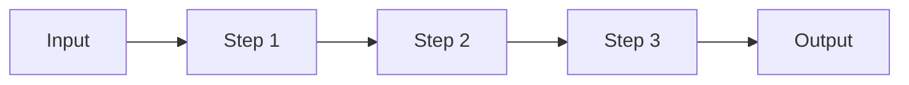

# Agent Interactions

AGiXT provides multiple ways to interact with agents, all powered by the same intelligent thinking/acting loop. The interaction method you choose depends on your use case.

## Chat

Chat is the primary and most versatile interaction mode. It's a natural conversation interface where the agent has full access to its capabilities.

### How Chat Works

When you chat with an agent:

1. **Context Assembly**: The system gathers relevant memories, conversation history, and any uploaded files
2. **Complexity Analysis**: The request is scored to determine appropriate reasoning depth
3. **Thinking/Acting Loop**: The agent reasons through the problem, executing commands as needed
4. **Streaming Response**: Tokens are streamed in real-time, including activities and the final answer

### Features

- **Memory Integration**: If you've trained the agent on files, websites, or other sources, it retrieves relevant context automatically
- **Command Execution**: The agent can use any enabled commands to help complete tasks
- **Multi-Turn Context**: Conversations maintain state across messages
- **Real-Time Streaming**: See the agent's thinking process and answer as they're generated

### API Usage

All chat interactions go through the `/v1/chat/completions` endpoint:

```python
response = agixt.chat_completions(
    agent_name="XT",
    messages=[{"role": "user", "content": "Analyze my sales data"}],
    stream=True
)
```

## Instruct

**Instructions are task-focused commands, not questions or conversations - use Chat for those!**

Instructions tell the agent to perform a specific action:

```
"Create a backup of all Python files in the project directory"
"Generate a summary of the meeting notes in meeting.txt"
"Search for all TODO comments in the codebase"
```

### How Instruct Works

The agent will:
1. Parse the instruction to understand the task
2. Plan the necessary steps
3. Execute commands from its available set
4. Report the results

If a command fails, the agent analyzes the error and attempts a different approach automatically.

## Prompt

The Prompt mode allows you to use predefined prompt templates to generate responses.

### Using Prompts

1. Select a prompt template from your prompt library
2. The template gets filled with variables (user input, context, etc.)
3. The formatted prompt is sent to the agent
4. The response follows the same thinking/acting loop

### Prompt Injection Variables

AGiXT provides many injection variables for prompts:

| Variable | Description |
|----------|-------------|
| `{user_input}` | The user's message |
| `{context}` | Retrieved memories and context |
| `{conversation_history}` | Recent conversation messages |
| `{COMMANDS}` | Available command examples |
| `{date}` | Current date/time |
| `{agent_name}` | Name of the agent |
| `{working_directory}` | Agent's workspace path |

View all available variables by checking "Show Prompt Injection Variable Documentation" in the UI.

## Advanced Options

These options are available for Chat, Instruct, and Prompt modes:

| Option | Description | Default |
|--------|-------------|---------|
| `context_results` | Number of memories to inject from vector search | 5 |
| `conversation_results` | Number of previous conversation messages to include | 5 |
| `inject_memories_from_collection_number` | Secondary memory collection to pull from | 0 |
| `browse_links` | Automatically scrape URLs in user input | true |
| `websearch` | Enable web search for additional information | false |
| `websearch_depth` | How many pages deep to search | 3 |
| `tts` | Enable text-to-speech response | false |
| `tts_mode` | TTS mode: `off`, `audio_only`, `interleaved` | off |

## Chains

Chains are predefined multi-step workflows that orchestrate agent actions.

### What are Chains?

A chain is a sequence of steps that execute in order:



Each step can be:
- A **prompt** - Run a prompt template with the agent
- A **command** - Execute a specific extension command
- Another **chain** - Nest chains for complex workflows

### Step Output Flow

The output of each step becomes available to subsequent steps through the `{step1}`, `{step2}`, etc. variables. This allows data to flow through the workflow.

### Running Chains

Chains accept a `user_input` parameter by default, but you can override any variable at runtime:

```python
result = agixt.run_chain(
    chain_name="Process Report",
    user_input="Q4 Sales Data",
    chain_args={
        "output_format": "PDF",
        "include_charts": True
    }
)
```

### Chain Options

| Option | Description |
|--------|-------------|
| Run a Single Step | Execute only one specific step |
| Step Number to Run | Which step to run (when single step enabled) |
| Start from Step | Begin execution from a specific step |
| Show All Responses | Display output from every step, not just the last |

### Use Cases for Chains

- **Repeatable Workflows**: Standard operating procedures
- **Data Processing**: Multi-stage ETL pipelines
- **Report Generation**: Gather, analyze, format, deliver
- **Automated Tasks**: Scheduled background processes

See [Chains](07-Chains.md) for detailed chain documentation.

## Memory & Context in Interactions

Every interaction benefits from AGiXT's memory system:

### Automatic Context Injection

During `format_prompt`, the system automatically:

1. Searches vector memories based on user input
2. Retrieves conversation history
3. Includes recent agent activities
4. Adds uploaded file contents
5. Injects company training data (if applicable)

### Memory Collections

Agents can have multiple memory collections:
- **Collection 0**: Default collection for general memories
- **Conversation Collections**: Memories specific to a conversation
- **Custom Collections**: Specialized knowledge bases

### Context Limits

AGiXT automatically manages context to stay within model token limits:
- Memories are truncated if too long
- Conversation history is trimmed to recent messages
- Large files provide access instructions instead of full content

## Real-Time Streaming

All interaction modes support real-time streaming via SSE (Server-Sent Events):

### Event Types

| Event | Description |
|-------|-------------|
| `chat.completion.chunk` | Text response tokens |
| `chat.completion.activity` | Agent activities (thinking, commands) |
| `audio.chunk` | TTS audio data |
| `remote_command.request` | Client-side tool execution request |

### Viewing Activities

Activities show the agent's reasoning process:
- `[ACTIVITY]` - High-level task descriptions
- `[SUBACTIVITY]` - Detailed step information
- Thinking and reflection tags in responses

## Best Practices

1. **Use Chat for questions and conversations** - It's the most flexible mode
2. **Use Instruct for specific tasks** - When you need action, not discussion
3. **Use Chains for repeatable workflows** - Standardize multi-step processes
4. **Enable only needed commands** - Too many commands can confuse the agent
5. **Train on relevant data** - Better memories lead to better responses
