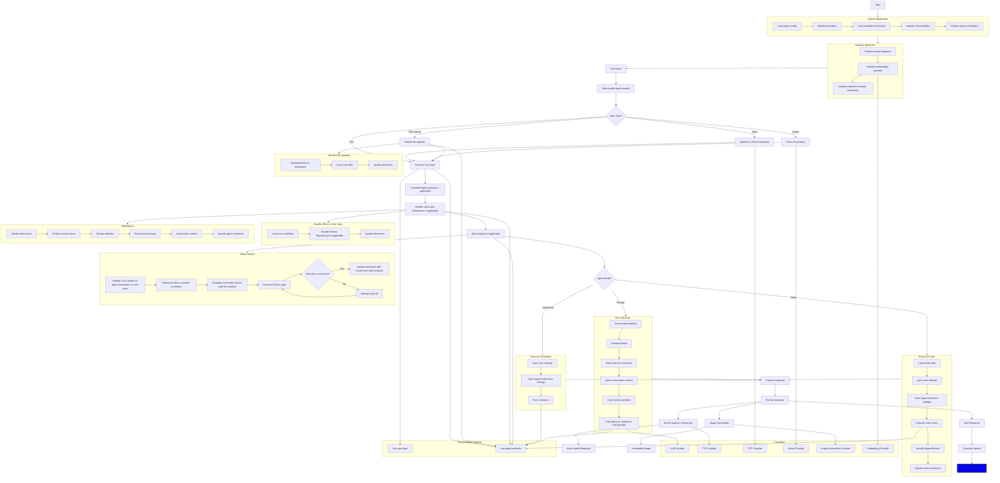

# AGiXT

[](https://github.com/sponsors/Josh-XT) [](https://paypal.me/joshxt) [](https://ko-fi.com/joshxt)

[](https://github.com/Josh-XT/AGiXT) [](https://github.com/AGiXT/AGiXT-Interactive)

[](https://github.com/AGiXT/python-sdk) [](https://pypi.org/project/agixtsdk/)

[](https://github.com/AGiXT/typescript-sdk) [](https://www.npmjs.com/package/agixt)

[](https://github.com/AGiXT/dart-sdk) [](https://github.com/birdup000/AGiXT-Rust-Dev) 
[](https://github.com/birdup000/AGiXT-Zig-SDK)

[](https://discord.gg/d3TkHRZcjD)
[](https://twitter.com/Josh_XT)
[](https://pump.fun/coin/F9TgEJLLRUKDRF16HgjUCdJfJ5BK6ucyiW8uJxVPpump)


AGiXT is a dynamic Artificial Intelligence Automation Platform engineered to orchestrate efficient AI instruction management and task execution across a multitude of providers. Our solution infuses adaptive memory handling with a broad spectrum of commands to enhance AI's understanding and responsiveness, leading to improved task completion. The platform's smart features, like Smart Instruct and Smart Chat, seamlessly integrate web search, planning strategies, and conversation continuity, transforming the interaction between users and AI. By leveraging a powerful plugin system that includes web browsing and command execution, AGiXT stands as a versatile bridge between AI models and users. With an expanding roster of AI providers, code evaluation capabilities, comprehensive chain management, and platform interoperability, AGiXT is consistently evolving to drive a multitude of applications, affirming its place at the forefront of AI technology.

Embracing the spirit of extremity in every facet of life, we introduce AGiXT. This advanced AI Automation Platform is our bold step towards the realization of Artificial General Intelligence (AGI). Seamlessly orchestrating instruction management and executing complex tasks across diverse AI providers, AGiXT combines adaptive memory, smart features, and a versatile plugin system to maximize AI potential. With our unwavering commitment to innovation, we're dedicated to pushing the boundaries of AI and bringing AGI closer to reality.

## Table of Contents 📖

- [AGiXT](#agixt)
  - [Table of Contents 📖](#table-of-contents-)
  - [⚠️ Disclaimers](#️-disclaimers)
    - [Monitor Your Usage](#monitor-your-usage)
  - [Key Features 🗝️](#key-features-️)
  - [Quick Start Guide](#quick-start-guide)
    - [Operating System Prerequisites](#operating-system-prerequisites)
      - [Windows and Mac Prerequisites](#windows-and-mac-prerequisites)
      - [Linux Prerequisites](#linux-prerequisites)
  - [Installation](#installation)
  - [Usage](#usage)
    - [Command-line Options](#command-line-options)
  - [Docker Deployment](#docker-deployment)
  - [Troubleshooting](#troubleshooting)
  - [Security Considerations](#security-considerations)
  - [Configuration](#configuration)
  - [Documentation](#documentation)
  - [Other Repositories](#other-repositories)
  - [History](#history)
  - [Workflow](#workflow)

## ⚠️ Disclaimers

### Monitor Your Usage

Please note that using some AI providers (such as OpenAI's GPT-4 API) can be expensive! Monitor your usage carefully to avoid incurring unexpected costs.  We're **NOT** responsible for your usage under any circumstances.

## Key Features 🗝️

- **Context and Token Management**: Adaptive handling of long-term and short-term memory for an optimized AI performance, allowing the software to process information more efficiently and accurately.
- **Smart Instruct**: An advanced feature enabling AI to comprehend, plan, and execute tasks effectively. The system leverages web search, planning strategies, and executes instructions while ensuring output accuracy.
- **Interactive Chat & Smart Chat**: User-friendly chat interface for dynamic conversational tasks. The Smart Chat feature integrates AI with web research to deliver accurate and contextually relevant responses.
- **Task Execution & Smart Task Management**: Efficient management and execution of complex tasks broken down into sub-tasks. The Smart Task feature employs AI-driven agents to dynamically handle tasks, optimizing efficiency and avoiding redundancy.
- **Chain Management**: Sophisticated handling of chains or a series of linked commands, enabling the automation of complex workflows and processes.
- **Web Browsing & Command Execution**: Advanced capabilities to browse the web and execute commands for a more interactive AI experience, opening a wide range of possibilities for AI assistance.
- **Multi-Provider Compatibility**: Seamless integration with leading AI providers such as OpenAI (as well as any that use OpenAI style endpoints), ezLocalai, Hugging Face, GPT4Free, Google Gemini, and more.
- **Versatile Plugin System & Code Evaluation**: Extensible command support for various AI models along with robust support for code evaluation, providing assistance in programming tasks.
- **Docker Deployment**: Simplified setup and maintenance through Docker deployment.
- **Audio-to-Text & Text-to-Speech Options**: Integration with Hugging Face for seamless audio-to-text transcription, and multiple TTS choices, featuring Brian TTS, Mac OS TTS, and ElevenLabs.
- **Platform Interoperability & AI Agent Management**: Streamlined creation, renaming, deletion, and updating of AI agent settings along with easy interaction with popular platforms like Twitter, GitHub, Google, DALL-E, and more.
- **Custom Prompts & Command Control**: Granular control over agent abilities through enabling or disabling specific commands, and easy creation, editing, and deletion of custom prompts to standardize user inputs.
- **RESTful API**: FastAPI-powered RESTful API for seamless integration with external applications and services.
- **Expanding AI Support**: Continually updated to include new AI providers and services, ensuring the software stays at the forefront of AI technology.

The features that AGiXT provides cover a wide range of services and are used for different tasks. Refer to [Processes and Frameworks](https://josh-xt.github.io/AGiXT/2-Concepts/01-Processes%20and%20Frameworks.html) for more details about the services and framework.

## Quick Start Guide

### Operating System Prerequisites

Provide the following prerequisites based on the Operating System you use.

#### Windows and Mac Prerequisites

- [Git](https://git-scm.com/downloads)
- [Docker Desktop](https://docs.docker.com/docker-for-windows/install/)
- [Python 3.10.x](https://www.python.org/downloads/)

#### Linux Prerequisites

- [Git](https://git-scm.com/downloads)
- [Docker](https://docs.docker.com/get-docker/)
- [Docker Compose](https://docs.docker.com/compose/install/)
- [Python 3.10.x](https://www.python.org/downloads/)
- [NVIDIA Container Toolkit](https://docs.nvidia.com/datacenter/cloud-native/container-toolkit/latest/install-guide.html) (if using local models on GPU)

## Installation

If you're using Linux, you may need to prefix the `python` command with `sudo` depending on your system configuration.

```bash
git clone https://github.com/Josh-XT/AGiXT
cd AGiXT
python start.py
```

The script will check for Docker and Docker Compose installation:

- On Linux, it will attempt to install them if missing (requires sudo privileges).
- On macOS and Windows, it will provide instructions to download and install Docker Desktop.

## Usage

Run the script with Python:

```bash
python start.py
```

To run AGiXT with ezLocalai, use the `--with-ezlocalai` flag:

```bash
python start.py --with-ezlocalai true
```

You can also use command-line arguments to set specific environment variables to run in different ways. For example, to use the development branch and enable auto-updates, run:

```bash
python start.py --agixt-branch dev --agixt-auto-update true --with-ezlocalai true
```

- Access the AGiXT Management interface at <http://localhost:8501> to create and manage your agents, prompts, chains, and configurations.
- Access the AGiXT Interactive interface at <http://localhost:3437> to interact with your configured agents.
- Access the AGiXT API documentation at <http://localhost:7437>

### Command-line Options

The script supports setting any of the environment variables via command-line arguments. Here's a detailed list of available options:

1. `--agixt-api-key`: Set the AGiXT API key (automatically generated if not provided)
2. `--agixt-uri`: Set the AGiXT URI (default: `http://localhost:7437`)
3. `--agixt-agent`: Set the default AGiXT agent (default: `AGiXT`)
4. `--agixt-branch`: Choose between `stable` and `dev` branches
5. `--agixt-file-upload-enabled`: Enable or disable file uploads (default: `true`)
6. `--agixt-voice-input-enabled`: Enable or disable voice input (default: `true`)
7. `--agixt-footer-message`: Set the footer message (default: `Powered by AGiXT`)
8. `--agixt-require-api-key`: Require API key for access (default: `false`)
9. `--agixt-rlhf`: Enable or disable reinforcement learning from human feedback (default: `true`)
10. `--agixt-show-selection`: Set which selectors to show in the UI (default: `conversation,agent`)
11. `--agixt-show-agent-bar`: Show or hide the agent bar in the UI (default: `true`)
12. `--agixt-show-app-bar`: Show or hide the app bar in the UI (default: `true`)
13. `--agixt-conversation-mode`: Set the conversation mode (default: `select`)
14. `--allowed-domains`: Set allowed domains for API access (default: `*`)
15. `--app-description`: Set the application description
16. `--app-name`: Set the application name (default: `AGiXT Chat`)
17. `--app-uri`: Set the application URI (default: `http://localhost:3437`)
18. `--auth-web`: Set the authentication web URI (default: `http://localhost:3437/user`)
19. `--auth-provider`: Set the authentication provider (options: `none`, `magicalauth`)
20. `--create-agent-on-register`: Create an agent named from your `AGIXT_AGENT` environment variable if it is different than `AGiXT` using settings from `default_agent.json` if defined (default: `true`)
21. `--create-agixt-agent`: Create an agent called `AGiXT` and trains it on the AGiXT documentation upon user registration (default: `true`)
22. `--disabled-providers`: Set disabled providers (comma-separated list)
23. `--disabled-extensions`: Set disabled extensions (comma-separated list)
24. `--working-directory`: Set the working directory (default: `./WORKSPACE`)
25. `--github-client-id`: Set GitHub client ID for authentication
26. `--github-client-secret`: Set GitHub client secret for authentication
27. `--google-client-id`: Set Google client ID for authentication
28. `--google-client-secret`: Set Google client secret for authentication
29. `--microsoft-client-id`: Set Microsoft client ID for authentication
30. `--microsoft-client-secret`: Set Microsoft client secret for authentication
31. `--tz`: Set the timezone (default: system timezone)
32. `--interactive-mode`: Set the interactive mode (default: `chat`)
33. `--theme-name`: Set the UI theme (options: `default`, `christmas`, `conspiracy`, `doom`, `easter`, `halloween`, `valentines`)
34. `--allow-email-sign-in`: Allow email sign-in (default: `true`)
35. `--database-type`: Set the database type (options: `sqlite`, `postgres`)
36. `--database-name`: Set the database name (default: `models/agixt`)
37. `--log-level`: Set the logging level (default: `INFO`)
38. `--log-format`: Set the log format (default: `%(asctime)s | %(levelname)s | %(message)s`)
40. `--uvicorn-workers`: Set the number of Uvicorn workers (default: `10`)
41. `--agixt-auto-update`: Enable or disable auto-updates (default: `true`)

Options specific to ezLocalai:

1. `--with-ezlocalai`: Start AGiXT with ezLocalai integration.
2. `--ezlocalai-uri`: Set the ezLocalai URI (default: `http://{local_ip}:8091`)
3. `--default-model`: Set the default language model for ezLocalai (default: `QuantFactory/dolphin-2.9.2-qwen2-7b-GGUF`)
4. `--vision-model`: Set the vision model for ezLocalai (default: `deepseek-ai/deepseek-vl-1.3b-chat`)
5. `--llm-max-tokens`: Set the maximum number of tokens for language models (default: `32768`)
6. `--whisper-model`: Set the Whisper model for speech recognition (default: `base.en`)
7. `--gpu-layers`: Set the number of GPU layers to use (automatically determined based on available VRAM but can be modified.) (default: `-1` for all)

For a full list of options with their current values, run:

```bash
python start.py --help
```

## Docker Deployment

After setting up the environment variables and ensuring Docker and Docker Compose are installed, the script will:

1. Stop any running AGiXT Docker containers
2. Pull the latest Docker images (if auto-update is enabled)
3. Start the AGiXT services using Docker Compose

## Troubleshooting

- If the script fails to run on Linux, run it with `sudo`.
- If you encounter any issues with Docker installation:
  - On Linux, ensure you have sudo privileges and that your system is up to date.
  - On macOS and Windows, follow the instructions to install Docker Desktop manually if the script cannot install it automatically.
- Check the Docker logs for any error messages if the containers fail to start.
- Verify that all required ports are available and not in use by other services.
- If the `python` command is not recognized, try using `python3` instead.

## Security Considerations

- The `AGIXT_API_KEY` is automatically generated if not provided. Ensure to keep this key secure and do not share it publicly.
- When using authentication providers (GitHub, Google, Microsoft), ensure that the client IDs and secrets are kept confidential.
- Be cautious when enabling file uploads and voice input, as these features may introduce potential security risks if not properly managed.

## Configuration

Each AGiXT Agent has its own settings for interfacing with AI providers, and other configuration options. These settings can be set and modified through the web interface.

## Documentation

Videos

https://github.com/user-attachments/assets/5dceb1b2-dfbc-4c2d-b648-974882eff08d

https://github.com/user-attachments/assets/2111009a-17e0-42e5-bcbc-843d127495e0


Need more information? Check out the [documentation](https://josh-xt.github.io/AGiXT) for more details to get a better understanding of the concepts and features of AGiXT.

## Other Repositories

Check out the other AGiXT repositories at <https://github.com/orgs/AGiXT/repositories> - these include the AGiXT Streamlit Web UI, AGiXT Python SDK, AGiXT TypeScript SDK, AGiXT Dart SDK, AGiXT C# SDK, and more!

## History


## Workflow


