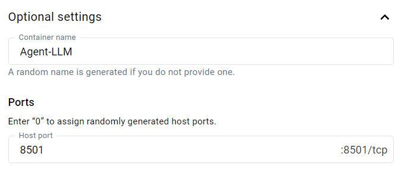

# AGiXT

 
[](https://github.com/josh-xt/AGiXT) 
[](https://github.com/Josh-XT/AGiXT/blob/main/LICENSE) 
 [](https://black.readthedocs.io/en/stable/the_black_code_style/index.html)

[](https://github.com/JamesonRGrieve/AGiXT-Frontend)

[](https://github.com/Josh-XT/AGiXT/labels/help%20wanted) 
[](https://github.com/JamesonRGrieve/AGiXT-Frontend/labels/help%20wanted) 
[](https://discord.gg/d3TkHRZcjD) 
[](https://twitter.com/AGiXT) 
[](https://www.facebook.com/groups/AGiXT)
[](https://twitter.com/AGiXT) 

Please use the outreach email for media, sponsorship, or to contact us for other miscellaneous purposes. 

**Do not** send us emails with troubleshooting requests, feature requests or bug reports, please direct those to [GitHub Issues](https://github.com/Josh-XT/AGiXT/issues) or [Discord](https://discord.gg/d3TkHRZcjD).

AGiXT is an Artificial Intelligence Automation Platform designed to power efficient AI instruction management across multiple providers. Our agents are equipped with adaptive memory, and this versatile solution offers a powerful plugin system that supports a wide range of commands, including web browsing. With growing support for numerous AI providers and models, AGiXT is constantly evolving to empower diverse applications.


## ⚠️ Run this in Docker or a Virtual Machine!
You're welcome to disregard this message, but if you do and the AI decides that the best course of action for its task is to build a command to format your entire computer, that is on you.  Understand that this is given full unrestricted terminal access by design and that we have no intentions of building any safeguards.  This project intends to stay light weight and versatile for the best possible research outcomes.

See also [SECURITY.md](1-Getting started/SECURITY.MD)

## ⚠️ Monitor Your Usage!
Please note that using some AI providers (such as OpenAI's GPT-4 API) can be expensive! Monitor your usage carefully to avoid incurring unexpected costs.  We're **NOT** responsible for your usage under any circumstance.

## ⚠️ Under Development!
This project is under active development and may still have issues. We appreciate your understanding and patience. If you encounter any problems, please first check the open issues. If your issue is not listed, kindly create a new issue detailing the error or problem you experienced. Thank you for your support!

## ⚠️ Necessities For Use
AGiXT brings you great power, but you will need to make sure you have the necessary knowledge and hardware to use it. You cannot simply dive in face first and expect to find any success, research and understanding of the technologies involved is required.

### Knowledge Required
You will need at minimum intermediate level knowledge in the following areas:
- Docker
- Python
- Large Language Models

We unfortunately cannot support Docker issues or issues running any local models. There is a bit of a learning curve to get into this stuff and we're focused on development, not support.  

**We cannot teach you how to use Docker or Python, you will need to refer to the documentation or ask an AI to help you.**  Please do not open issues for a lack of knowledge in these areas, they will be closed asking you to refer to the documentation.

### Hardware Required
Good luck getting a straight answer! Due to the nature of AGiXT, you can run it from a mobile phone or from an enterprise grade AI server. If you're running your agents with OpenAI as the provider, you can run it on just about anything with an API key, enough storage, and an internet connection.

The hardware you need will depend on the AI models you want to run and the number of agents you want to run at the same time.  We recommend starting with a single agent and a single AI model and then scaling up from there.

Please do not open issues for lack of hardware, this means errors related to hitting token limits on local models, running out of memory, and issues directly related to ANY local providers such as Oobaboooga, llama.cpp, etc.  We know that the providers work as they've been tested and confirmed working, if they're not working on your hardware, it's a problem with your hardware most likely.

### Operating Systems
The development environment used when building AGiXT is Ubuntu 22.04.  As far as we're aware, it should run on any Linux-based OS, MacOS, and Windows as long as hardware requirements are met. 

We cannot support Windows related issues.  Windows has firewalls and things working against developers actively which is why we do not use it for development (or any other thing.) There are people in [our Discord server](https://discord.gg/d3TkHRZcjD) that are actively using AGiXT on Windows, MacOS, and Linux.  

If you have issues with Windows, please ask in Discord, but please do not tag the developers to ask, we don't use it.

## Table of Contents 📖

- [AGiXT](#agixt)
  - [⚠️ Run this in Docker or a Virtual Machine!](#️-run-this-in-docker-or-a-virtual-machine)
  - [⚠️ Monitor Your Usage!](#️-monitor-your-usage)
  - [⚠️ Under Development!](#️-under-development)
  - [⚠️ Necessities For Use](#️-necessities-for-use)
    - [Knowledge Required](#knowledge-required)
    - [Hardware Required](#hardware-required)
    - [Operating Systems](#operating-systems)
  - [Table of Contents 📖](#table-of-contents-)
  - [Media Coverage ⏯️](#media-coverage-️)
    - [Video](#video)
  - [Key Features 🗝️](#key-features-️)
  - [Web Application Features](#web-application-features)
  - [Run with Docker](#run-with-docker)
    - [Linux or Windows](#linux-or-windows)
    - [Windows Docker Desktop (streamlit only example)](#windows-docker-desktop-streamlit-only-example)
    - [Development using docker](#development-using-docker)
  - [Manual Install from source (unsupported)](#manual-install-from-source-unsupported)
    - [Back End](#back-end)
    - [Front End](#front-end)
  - [Configuration](#configuration)
  - [API Endpoints](#api-endpoints)
  - [Extending Functionality](#extending-functionality)
    - [Updating Requirements](#updating-requirements)
    - [Commands](#commands)
    - [AI Providers](#ai-providers)
  - [Documentation](#documentation)
  - [Contributing](#contributing)
  - [Donations and Sponsorships](#donations-and-sponsorships)
  - [Our Team 🧑‍💻](#our-team-)
  - [Acknowledgments](#acknowledgments)
  - [History](#history)

## Media Coverage ⏯️

### Video
- From [World of AI](https://www.youtube.com/@intheworldofai) on YouTube: [AGiXT: AI Automation Bot for Managing and Implementing AI Through Applications](https://www.youtube.com/watch?v=g0_36Mf2-To)


## Key Features 🗝️

- **Adaptive Memory Management**: Efficient long-term and short-term memory handling for improved AI performance.
- **Versatile Plugin System**: Extensible command support for various AI models, ensuring flexibility and adaptability.
- **Multi-Provider Compatibility**: Seamless integration with leading AI providers, including OpenAI GPT series, Hugging Face Huggingchat, GPT4All, GPT4Free, Oobabooga Text Generation Web UI, Kobold, llama.cpp, FastChat, Google Bard, Bing, and more. Run any model with AGiXT!
- **Web Browsing & Command Execution**: Advanced capabilities to browse the web and execute commands for a more interactive AI experience.
- **Code Evaluation**: Robust support for code evaluation, providing assistance in programming tasks.
- **Docker Deployment**: Effortless deployment using Docker, simplifying setup and maintenance.
- **Audio-to-Text Conversion**: Integration with Hugging Face for seamless audio-to-text transcription.
- **Platform Interoperability**: Easy interaction with popular platforms like Twitter, GitHub, Google, DALL-E, and more.
- **Text-to-Speech Options**: Multiple TTS choices, featuring Brian TTS, Mac OS TTS, and ElevenLabs.
- **Expanding AI Support**: Continuously updated to include new AI providers and services.
- **AI Agent Management**: Streamlined creation, renaming, deletion, and updating of AI agent settings.
- **Flexible Chat Interface**: User-friendly chat interface for conversational and instruction-based tasks.
- **Task Execution**: Efficient starting, stopping, and monitoring of AI agent tasks with asynchronous execution.
- **Chain Management**: Sophisticated management of multi-agent task chains for complex workflows and collaboration.
- **Custom Prompts**: Easy creation, editing, and deletion of custom prompts to standardize user inputs.
- **Command Control**: Granular control over agent abilities through enabling or disabling specific commands.
- **RESTful API**: FastAPI-powered RESTful API for seamless integration with external applications and services.

## Web Application Features

The frontend web application of AGiXT provides an intuitive and interactive user interface for users to:

- Manage agents: View the list of available agents, add new agents, delete agents, and switch between agents.
- Set objectives: Input objectives for the selected agent to accomplish.
- Start tasks: Initiate the task manager to execute tasks based on the set objective.
- Instruct agents: Interact with agents by sending instructions and receiving responses in a chat-like interface.
- Available commands: View the list of available commands and click on a command to insert it into the objective or instruction input boxes.
- Dark mode: Toggle between light and dark themes for the frontend.
- Built using NextJS and Material-UI
- Communicates with the backend through API endpoints

## Run with Docker

Clone the repositories for the AGiXT front/back ends then start the services with Docker.

### Linux or Windows


```
git clone https://github.com/Josh-XT/AGiXT
cd AGiXT
```

Choose a service you want to run using profiles, e.g.
`docker compose --profile streamlit up`

Run all available services
`docker compose --profile all up`

- AGiXT-frontend http://localhost:3000
- streamlit-UI http://localhost:8501

### Windows Docker Desktop (streamlit only example)




### Development using docker
```
docker compose --profile all -f docker-compose.yml -f docker-compose.dev.yaml up
```

* mounts dev space into container - happy building 


## Manual Install from source (unsupported)

As a reminder, this can be dangerous to run locally depending on what commands you give your agents access to.  [⚠️ Run this in Docker or a Virtual Machine!](#️-run-this-in-docker-or-a-virtual-machine)

### Back End

Clone the repository for the AGiXT back end and start it.

```
git clone https://github.com/Josh-XT/AGiXT
cd AGiXT
pip install -r requirements.txt
python app.py
```

### Front End

Clone the repository for the AGiXT front end in a separate terminal and start it.

```
git clone https://github.com/JamesonRGrieve/AGiXT-Frontend --recurse-submodules 
cd AGiXT-Frontend
yarn install
yarn dev
```

Access the web interface at http://localhost:3000

## Configuration

AGiXT utilizes a `.env` configuration file to store AI language model settings, API keys, and other options. Use the supplied `.env.example` as a template to create your personalized `.env` file. Configuration settings include:

- **WORKING_DIRECTORY**: Set the agent's working directory.
- **EXTENSIONS_SETTINGS**: Configure settings for OpenAI, Hugging Face, Selenium, Twitter, and GitHub.
- **VOICE_OPTIONS**: Choose between Brian TTS, Mac OS TTS, or ElevenLabs for text-to-speech.

For a detailed explanation of each setting, refer to the `.env.example` file provided in the repository.

## API Endpoints

AGiXT provides several API endpoints for managing agents, prompts and chains.

To learn more about the API endpoints and their usage, visit the API documentation at 
- [Swagger](http://localhost:7437)
- [Redoc](http://localhost:7437/redoc)

This documentation is hosted locally and the frontend must be running for these links to work.

## Extending Functionality

### Updating Requirements

When extending functionality ensure to perform the following inside the top level AGiXT directory after saving your changes / customizations:

```
pip install pipreqs
pipreqs ./ --savepath gen_requirements.txt --ignore bin,etc,include,lib,lib64,env,venv
pip install --no-cache-dir -r gen_requirements.txt
```
This will generate an updated requirements file, and install the new dependencies required to support your modifications.

### Commands

To introduce new commands, generate a new Python file in the `commands` folder and define a class inheriting from the `Commands` class. Implement the desired functionality as methods within the class and incorporate them into the `commands` dictionary.

### AI Providers

Each agent will have its own AI provider and provider settings such as model, temperature, and max tokens, depending on the provider.  You can use this to make certain agents better at certain tasks by giving them more advanced models to complete certain steps in chains.

## Documentation

In `docs/` folder. Can be used to generate static html output. See `deploy-docs` section in [Publish Workflow](/.github/workflows/python-publish.yml) howto build with honkit.

## Contributing

[](https://github.com/Josh-XT/AGiXT/labels/help%20wanted) 

We welcome contributions to AGiXT! If you're interested in contributing, please check out our [contributions guide](https://github.com/Josh-XT/AGiXT/tree/main/.github/CONTRIBUTING.md) the [open issues on the backend](https://github.com/Josh-XT/AGiXT/issues), [open issues on the frontend](https://github.com/JamesonRGrieve/AGiXT-Frontend/issues) and [pull requests](https://github.com/Josh-XT/AGiXT/pulls), submit a [pull request](https://github.com/Josh-XT/AGiXT/pulls/new), or [suggest new features](https://github.com/Josh-XT/AGiXT/issues/new). To stay updated on the project's progress, [](https://twitter.com/AGiXT), [](https://twitter.com/Josh_XT) and [](https://twitter.com/JamesonRGrieve). Also feel free to join our [](https://discord.gg/d3TkHRZcjD).

## Donations and Sponsorships
We appreciate any support for AGiXT's development, including donations, sponsorships, and any other kind of assistance. If you would like to support us, please contact us through our [](https://twitter.com/AGiXT) , [](https://discord.gg/d3TkHRZcjD) or [](https://twitter.com/AGiXT).

We're always looking for ways to improve AGiXT and make it more useful for our users. Your support will help us continue to develop and enhance the application. Thank you for considering to support us!

## Our Team 🧑‍💻
| Josh (@Josh-XT)                    | James (@JamesonRGrieve) | 
|-----------------------------------|-----------------------------------|
|[](https://github.com/Josh-XT)|[](https://github.com/JamesonRGrieve)|
|[](https://twitter.com/Josh_XT)|[](https://twitter.com/JamesonRGrieve)|
|[](https://www.linkedin.com/in/joshxt/)|[](https://www.linkedin.com/in/jamesonrgrieve/)|

## Acknowledgments

This project was inspired by and is built using code from the following open-source repositories:

- [ ](https://github.com/yoheinakajima/babyagi)
- [ ](https://github.com/Significant-Gravitas/Auto-GPT)

Please consider exploring and contributing to these projects if you like what we are doing.

## History

