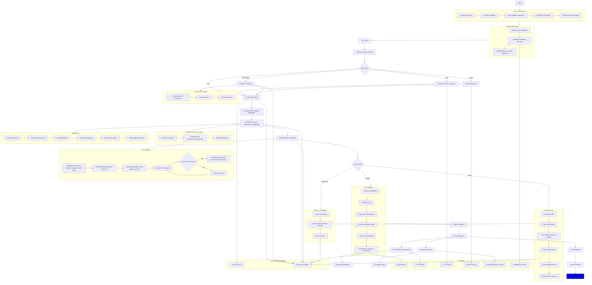

# AGiXT

[](https://github.com/sponsors/Josh-XT) [](https://paypal.me/joshxt) [](https://ko-fi.com/joshxt)

[](https://github.com/Josh-XT/AGiXT) [](https://github.com/AGiXT/Interactive)

[](https://github.com/AGiXT/python-sdk) [](https://pypi.org/project/agixtsdk/)

[](https://github.com/AGiXT/typescript-sdk) [](https://www.npmjs.com/package/agixt)

[](https://github.com/AGiXT/dart-sdk) [](https://github.com/birdup000/AGiXT-Rust-Dev)
[](https://github.com/birdup000/AGiXT-Zig-SDK)

[](https://discord.gg/d3TkHRZcjD)
[](https://twitter.com/Josh_XT)
[](https://pump.fun/coin/F9TgEJLLRUKDRF16HgjUCdJfJ5BK6ucyiW8uJxVPpump)


> **AGiXT is a comprehensive AI automation platform that transforms how you interact with artificial intelligence. With 40+ built-in extensions, multi-provider support, and enterprise-grade features, AGiXT serves as the central nervous system for your digital and physical environments.**

## 🌟 Overview

AGiXT is not just another AI framework—it's a complete automation platform that bridges the gap between artificial intelligence and real-world applications. Whether you're controlling smart home devices, managing enterprise workflows, trading cryptocurrencies, or developing complex applications, AGiXT provides the tools and infrastructure to make it happen through natural language interactions.

### 🚀 What Makes AGiXT Unique

- **40+ Built-in Extensions**: From Tesla vehicle control to enterprise asset management
- **Multi-Provider Support**: Work with OpenAI, Anthropic, Google, Azure, local models, and more
- **Enterprise-Ready**: OAuth, multi-tenancy, advanced security, and compliance features
- **Natural Language Control**: Manage complex systems through simple conversations
- **Workflow Automation**: Chain multiple services and create sophisticated automation sequences
- **Real-Time Integration**: WebSockets, webhooks, and live data feeds for immediate responses

### 📈 Use Cases & Impact

**🏠 Smart Home Automation**: *"Start my car's climate control, have Roomba clean the house, and arm the security system"*

**💼 Enterprise Operations**: *"Generate quarterly reports from the database, schedule team meetings, and update project status across all platforms"*

**🔗 Blockchain & DeFi**: *"Check my Solana wallet balance, stake 500 SOL with the best validator, and swap tokens on Jupiter DEX"*

**🏥 Health & Fitness**: *"Sync data from all my fitness devices, analyze my sleep trends, and schedule optimal workout times"*

## 🚀 Quick Start Guide

### ⚡ Prerequisites

**Windows and Mac:**

- [Git](https://git-scm.com/downloads)
- [Docker Desktop](https://docs.docker.com/docker-for-windows/install/)
- [Python 3.10+](https://www.python.org/downloads/)

**Linux:**

- [Git](https://git-scm.com/downloads)
- [Docker](https://docs.docker.com/get-docker/)
- [Docker Compose](https://docs.docker.com/compose/install/)
- [Python 3.10+](https://www.python.org/downloads/)
- [NVIDIA Container Toolkit](https://docs.nvidia.com/datacenter/cloud-native/container-toolkit/latest/install-guide.html) *(for local GPU models)*

### 📥 Installation

#### Option 1: PyPI Installation (Recommended)

The simplest way to get started:

```bash
pip install agixt
agixt start
```

That's it! AGiXT automatically handles Docker setup and starts all services.

> 🤖 **ezLocalai Included**: By default, AGiXT starts with [ezLocalai](https://github.com/DevXT-LLC/ezlocalai) for local AI inference. This provides local LLM, vision, TTS, and STT capabilities out of the box. To disable, set `WITH_EZLOCALAI=false` in your environment.

#### Option 2: Development Installation

For development or customization:

```bash
git clone https://github.com/Josh-XT/AGiXT
cd AGiXT
pip install -e .
agixt start
```

#### Option 3: Local Installation (Without Docker)

```bash
pip install agixt
agixt start --local
```

#### 🛠️ AGiXT CLI Commands

The AGiXT CLI provides comprehensive commands for managing your entire AGiXT ecosystem:

**AGiXT Core Management:**

```bash
# Local Mode (without Docker)
agixt start --local              # Start AGiXT locally
agixt stop --local               # Stop AGiXT local instance
agixt restart --local            # Restart AGiXT local instance
agixt logs --local [-f]          # View local logs (use -f to follow)

# Docker Mode (default)
agixt start                      # Start AGiXT with Docker
agixt stop                       # Stop AGiXT Docker services
agixt restart                    # Restart AGiXT Docker services
agixt logs [-f]                  # View Docker logs (use -f to follow)
```

**Web Interface Management:**

```bash
# Local Mode (npm run dev)
agixt start --web --local        # Start web dev server
agixt stop --web --local         # Stop web dev server
agixt restart --web --local      # Restart web dev server
agixt logs --web                 # View web interface logs info

# Docker Mode
agixt start --web                # Start web Docker service
agixt stop --web                 # Stop web Docker service
agixt restart --web              # Restart web Docker service
```

> 🎯 **Auto-Configuration**: Web interface `.env` file is automatically created with values from AGiXT backend

**ezLocalai Management (Local AI Models):**

> 🤖 **Default Behavior**: ezLocalai is automatically started with `agixt start` when `WITH_EZLOCALAI=true` (the default). Set `WITH_EZLOCALAI=false` to disable.

```bash
agixt start --ezlocalai          # Start ezLocalai only
agixt stop --ezlocalai           # Stop ezLocalai only
agixt restart --ezlocalai        # Restart ezLocalai only
agixt logs --ezlocalai [-f]      # View ezLocalai logs (use -f to follow)

# Disable ezLocalai from starting with AGiXT
agixt env WITH_EZLOCALAI=false
```

> 🎯 **Auto-Configuration**: ezLocalai automatically detects GPU availability and optimizes settings. Configuration is stored in `~/.ezlocalai/.env`.

**All Services Management:**

```bash
# Default behavior: AGiXT + ezLocalai start together
agixt start [--local]            # Starts AGiXT + ezLocalai
agixt stop [--local]             # Stops AGiXT + ezLocalai
agixt restart [--local]          # Restarts AGiXT + ezLocalai

# Include web interface too
agixt start --all [--local]      # Start AGiXT + ezLocalai + web
agixt stop --all [--local]       # Stop all services
agixt restart --all [--local]    # Restart all services
```

**Environment Variable Management:**

```bash
# View all available environment variables with current values
agixt env help

# Set environment variables
agixt env KEY=VALUE              # Set a single variable
agixt env KEY1=VALUE1 KEY2=VALUE2  # Set multiple variables

# Examples:
agixt env AGIXT_API_KEY=your_api_key_here
agixt env DEFAULT_MODEL="bartowski/deepseek-ai_DeepSeek-R1-0528-Qwen3-8B-GGUF"
agixt env OPENAI_API_KEY=sk-... ANTHROPIC_API_KEY=sk-ant-...
```

> 💡 **Configuration Categories**: Core, Application, Database, Server, Health Check, Chroma, Storage, AI Model, ezLocalai, Extensions, Payment, OAuth, and Agent Configuration

**Tips & Notes:**

- 📂 **Log Files**: Local logs stored in `~/.agixt/agixt-local-*.log` (keeps 5 most recent)
- 🔄 **Auto-Updates**: Environment changes in backend automatically sync to web and ezLocalai
- 🤖 **ezLocalai Default**: ezLocalai starts automatically with AGiXT (disable with `WITH_EZLOCALAI=false`)
- 🎮 **GPU Detection**: ezLocalai automatically detects NVIDIA GPU and enables GPU acceleration
- 🌐 **Web .env**: Contains AGIXT_SERVER, APP_URI, APP_NAME, STRIPE keys, AGIXT_AGENT, and auth settings
- 🤖 **ezLocalai Config**: Stored in `~/.ezlocalai/.env` with GPU settings, models, and performance options

### 🎯 Access AGiXT

After installation, access these interfaces:

- **🌐 AGiXT Interface**: [http://localhost:3437](http://localhost:3437) - Complete management and chat interface
- **📚 API Documentation**: [http://localhost:7437](http://localhost:7437) - Complete API reference

### ⚙️ Advanced Options

**Complete Stack with All Services:**

```bash
# Default: AGiXT + ezLocalai (local inference)
agixt start --local

# Include web interface
agixt start --all --local

# Or with Docker
agixt start --all

# Disable local inference (AGiXT only)
agixt env WITH_EZLOCALAI=false
agixt start --local
```

**Customize Configuration:**

```bash
# Configure environment variables
agixt env AGIXT_BRANCH=dev
agixt env DEFAULT_MODEL="bartowski/deepseek-ai_DeepSeek-R1-0528-Qwen3-8B-GGUF"
agixt env OPENAI_API_KEY=your_key_here

# Start services with your configuration
agixt start --all --local
```

**Managing Individual Services:**

```bash
# Start only what you need
agixt start --local                    # Just AGiXT backend
agixt start --ezlocalai                # Add local AI models
agixt start --web --local              # Add web interface

# Or use Docker mode (omit --local)
agixt start                            # AGiXT backend
agixt start --ezlocalai                # Local AI models
agixt start --web                      # Web interface
```

**View All Configuration Options:**

```bash
# See all 154+ environment variables organized by category
agixt env help
```

**Key Configuration Categories:**

- `Core Configuration`: AGIXT_API_KEY, AGIXT_URI, AGIXT_PORT, AGIXT_AGENT, etc.
- `AI Model Configuration`: Model selection, max tokens, API keys for various providers
- `ezLocalai Configuration`: GPU_LAYERS, DEFAULT_MODEL, LLM_MAX_TOKENS, WHISPER_MODEL, etc.
- `Database Configuration`: Database type, credentials, connection settings
- `Storage Configuration`: S3, B2, Azure storage backend settings
- `OAuth Configuration`: GitHub, Google, Microsoft, Discord client IDs and secrets
- `Payment Configuration`: Stripe and Solana wallet settings
- And 6+ more categories - run `agixt env help` to explore all options

### ⚠️ Important Notes

- **Monitor Usage**: AI providers like OpenAI can be expensive - track your usage!
- **API Key Security**: Keep your generated `AGIXT_API_KEY` secure
- **Port Availability**: Ensure ports 7437 (AGiXT API), 3437 (Web UI), and 8091 (ezLocalai) are available
- **Automatic Configuration**: Web and ezLocalai `.env` files are automatically created from backend settings
- **GPU Optimization**: ezLocalai automatically calculates optimal GPU layers based on available VRAM
- **Environment Management**: Use `agixt env` commands to manage all 154+ configuration variables
- **Linux Users**: May need to prefix commands with `sudo` for Docker operations

## Table of Contents 📖

- [AGiXT](#agixt)
  - [🌟 Overview](#-overview)
    - [🚀 What Makes AGiXT Unique](#-what-makes-agixt-unique)
    - [📈 Use Cases \& Impact](#-use-cases--impact)
  - [🚀 Quick Start Guide](#-quick-start-guide)
    - [⚡ Prerequisites](#-prerequisites)
    - [📥 Installation](#-installation)
      - [Option 1: Docker Installation (Recommended)](#option-1-docker-installation-recommended)
      - [Option 2: Local Installation (Without Docker)](#option-2-local-installation-without-docker)
      - [🛠️ AGiXT CLI Commands](#️-agixt-cli-commands)
    - [🎯 Access AGiXT](#-access-agixt)
    - [⚙️ Advanced Options](#️-advanced-options)
    - [⚠️ Important Notes](#️-important-notes)
  - [Table of Contents 📖](#table-of-contents-)
  - [🔮 Advanced AI Capabilities](#-advanced-ai-capabilities)
    - [Intelligent Task Planning](#intelligent-task-planning)
    - [OpenAI-Compatible Chat Completions](#openai-compatible-chat-completions)
    - [Advanced Audio Processing](#advanced-audio-processing)
    - [Visual Intelligence](#visual-intelligence)
    - [Smart Data Analysis](#smart-data-analysis)
    - [Web Research and Learning](#web-research-and-learning)
    - [Enterprise Worker Management](#enterprise-worker-management)
    - [Distributed Task Processing](#distributed-task-processing)
    - [Advanced Middleware System](#advanced-middleware-system)
    - [Real-time Streaming Capabilities](#real-time-streaming-capabilities)
    - [Batch Processing Engine](#batch-processing-engine)
    - [Direct Preference Optimization (DPO)](#direct-preference-optimization-dpo)
    - [Advanced Code Intelligence](#advanced-code-intelligence)
    - [Dynamic Model Conversion](#dynamic-model-conversion)
    - [Advanced Data Analysis Engine](#advanced-data-analysis-engine)
    - [Workspace File Management](#workspace-file-management)
    - [Intelligent Conversation Management](#intelligent-conversation-management)
    - [Advanced Input Analysis](#advanced-input-analysis)
  - [🤖 Agent Management System](#-agent-management-system)
    - [Multi-Agent Architecture](#multi-agent-architecture)
    - [Agent Features](#agent-features)
  - [🔧 Multi-Provider AI System](#-multi-provider-ai-system)
    - [Multi-Provider Support](#multi-provider-support)
      - [Core Providers](#core-providers)
        - [OpenAI Provider](#openai-provider)
        - [Anthropic Provider](#anthropic-provider)
        - [Google Provider](#google-provider)
        - [Azure Provider](#azure-provider)
        - [ezLocalAI Provider](#ezlocalai-provider)
        - [Additional Providers](#additional-providers)
      - [Rotation Provider](#rotation-provider)
    - [Provider Features](#provider-features)
  - [💬 Conversation Management](#-conversation-management)
    - [Advanced Conversation System](#advanced-conversation-system)
    - [Conversation Features](#conversation-features)
  - [🧠 Memory System](#-memory-system)
    - [Long-term Memory](#long-term-memory)
    - [Memory Features](#memory-features)
  - [🔗 Chain System (Workflow Automation)](#-chain-system-workflow-automation)
    - [Workflow Orchestration](#workflow-orchestration)
    - [Chain Features](#chain-features)
  - [🚀 Extension System - The Heart of AGiXT](#-extension-system---the-heart-of-agixt)
    - [Core Extension Architecture](#core-extension-architecture)
      - [Dynamic Extension Discovery](#dynamic-extension-discovery)
      - [Extension Lifecycle Management](#extension-lifecycle-management)
      - [Agent-Extension Integration](#agent-extension-integration)
    - [Extension Development Framework](#extension-development-framework)
      - [Base Extension Class](#base-extension-class)
      - [Advanced Extension Features](#advanced-extension-features)
      - [Security and Isolation](#security-and-isolation)
    - [📦 Built-in Extensions (40+ Available)](#-built-in-extensions-40-available)
      - [🌐 Social \& Communication Extensions](#-social--communication-extensions)
      - [💼 Development \& Code Management](#-development--code-management)
      - [🌐 Google \& Microsoft Ecosystems](#-google--microsoft-ecosystems)
      - [🏠 IoT \& Smart Home Integration](#-iot--smart-home-integration)
      - [🏥 Health \& Fitness Tracking](#-health--fitness-tracking)
      - [💰 E-commerce \& Business Operations](#-e-commerce--business-operations)
      - [🔗 Blockchain \& Cryptocurrency](#-blockchain--cryptocurrency)
      - [🗄️ Database Integration](#️-database-integration)
      - [🔧 Specialized Utility Extensions](#-specialized-utility-extensions)
    - [💡 Extension Command Examples](#-extension-command-examples)
      - [Tesla Vehicle Control Commands](#tesla-vehicle-control-commands)
      - [GitHub Development Commands](#github-development-commands)
      - [Solana Blockchain Commands](#solana-blockchain-commands)
      - [Discord Server Management Commands](#discord-server-management-commands)
      - [Health \& Fitness Data Commands](#health--fitness-data-commands)
      - [Google Workspace Commands](#google-workspace-commands)
      - [Microsoft 365 Commands](#microsoft-365-commands)
      - [DJI Tello Drone Commands](#dji-tello-drone-commands)
      - [Long Term Memory Commands](#long-term-memory-commands)
      - [Walmart Marketplace Commands](#walmart-marketplace-commands)
    - [🎯 Real-World Usage Scenarios](#-real-world-usage-scenarios)
      - [Smart Home \& IoT Automation](#smart-home--iot-automation)
      - [Developer Workflow Automation](#developer-workflow-automation)
      - [Health \& Fitness Management](#health--fitness-management)
      - [Business Operations Management](#business-operations-management)
      - [Enterprise \& Productivity Management](#enterprise--productivity-management)
      - [Blockchain \& DeFi Operations](#blockchain--defi-operations)
    - [🔄 Extension Workflow Integration](#-extension-workflow-integration)
      - [Complete E-commerce Management Workflow](#complete-e-commerce-management-workflow)
      - [Smart Home Evening Routine](#smart-home-evening-routine)
      - [Comprehensive Health \& Fitness Workflow](#comprehensive-health--fitness-workflow)
      - [Enterprise Productivity \& Asset Management](#enterprise-productivity--asset-management)
      - [Advanced Development \& Deployment Pipeline](#advanced-development--deployment-pipeline)
    - [🚀 Benefits for Users](#-benefits-for-users)
    - [🎉 The Complete Digital Assistant Experience](#-the-complete-digital-assistant-experience)
    - [Built-in Extension Categories](#built-in-extension-categories)
      - [Core System Extensions](#core-system-extensions)
      - [Communication and Social](#communication-and-social)
      - [Database and Storage](#database-and-storage)
      - [IoT and Hardware Integration](#iot-and-hardware-integration)
      - [Blockchain and Finance](#blockchain-and-finance)
      - [Health and Fitness](#health-and-fitness)
      - [E-commerce and Business](#e-commerce-and-business)
    - [Extensions Hub Architecture](#extensions-hub-architecture)
      - [External Repository Management](#external-repository-management)
      - [Hub Features](#hub-features)
      - [Hub Enterprise Features](#hub-enterprise-features)
    - [Extension Command System](#extension-command-system)
      - [Command Discovery and Registration](#command-discovery-and-registration)
      - [Command Execution Framework](#command-execution-framework)
      - [Chain Integration](#chain-integration)
    - [Development and Customization](#development-and-customization)
      - [Advanced Extension Integration Example](#advanced-extension-integration-example)
        - [Complete Database Integration](#complete-database-integration)
        - [Full REST API Generation](#full-rest-api-generation)
        - [Comprehensive Webhook System](#comprehensive-webhook-system)
        - [Agent Command Integration](#agent-command-integration)
        - [Enterprise-Grade Features](#enterprise-grade-features)
      - [Custom Extension Development](#custom-extension-development)
      - [Extension Ecosystem](#extension-ecosystem)
  - [🛡️ Authentication and Security](#️-authentication-and-security)
    - [MagicalAuth System](#magicalauth-system)
      - [Core Authentication Features](#core-authentication-features)
      - [OAuth 2.0 / Single Sign-On Integration](#oauth-20--single-sign-on-integration)
        - [Microsoft OAuth Provider](#microsoft-oauth-provider)
        - [Google OAuth Provider](#google-oauth-provider)
        - [Authentication Flow Features](#authentication-flow-features)
      - [User Management](#user-management)
      - [Email Integration](#email-integration)
        - [Supported Email Providers](#supported-email-providers)
        - [Email Features](#email-features)
      - [Security Features](#security-features)
      - [Enterprise Features](#enterprise-features)
  - [📊 Task Management System](#-task-management-system)
    - [Intelligent Task Scheduling](#intelligent-task-scheduling)
    - [Task Features](#task-features)
  - [🌐 Web Interface and API](#-web-interface-and-api)
    - [RESTful API](#restful-api)
    - [Real-time Features](#real-time-features)
  - [� Prompt Management System](#-prompt-management-system)
    - [Advanced Prompt Engineering](#advanced-prompt-engineering)
    - [Prompt Features](#prompt-features)
  - [🔄 Interactions System](#-interactions-system)
    - [Agent Interactions](#agent-interactions)
    - [Interaction Features](#interaction-features)
  - [📁 Workspace Management](#-workspace-management)
    - [File System Management](#file-system-management)
    - [Workspace Features](#workspace-features)
    - [Speech-to-Text Integration](#speech-to-text-integration)
    - [Voice Features](#voice-features)
  - [� Web Search and Browsing](#-web-search-and-browsing)
    - [Intelligent Web Search](#intelligent-web-search)
    - [Web Browsing Features](#web-browsing-features)
  - [🤖 Model Tuning and Training](#-model-tuning-and-training)
    - [Fine-tuning Capabilities](#fine-tuning-capabilities)
    - [Training Features](#training-features)
  - [⚙️ System Configuration and Management](#️-system-configuration-and-management)
    - [Global Configuration System](#global-configuration-system)
    - [System Features](#system-features)
  - [🎨 API Models and Data Structures](#-api-models-and-data-structures)
    - [Comprehensive Data Models](#comprehensive-data-models)
    - [Model Features](#model-features)
  - [🔌 Webhook System](#-webhook-system)
    - [Event-Driven Architecture](#event-driven-architecture)
    - [Webhook Features](#webhook-features)
  - [🎛️ Model Context Protocol (MCP) Integration](#️-model-context-protocol-mcp-integration)
    - [MCP Client Support](#mcp-client-support)
    - [MCP Features](#mcp-features)
  - [🏢 Multi-Tenancy and Enterprise Features](#-multi-tenancy-and-enterprise-features)
    - [Enterprise-Grade Architecture](#enterprise-grade-architecture)
    - [Scalability Features](#scalability-features)
  - [🔧 Development and Deployment](#-development-and-deployment)
    - [Developer-Friendly Features](#developer-friendly-features)
    - [Deployment Options](#deployment-options)
  - [📈 Monitoring and Analytics](#-monitoring-and-analytics)
    - [Observability](#observability)
    - [Reporting Features](#reporting-features)
  - [🎯 Key Benefits](#-key-benefits)
    - [For Developers](#for-developers)
    - [For Enterprises](#for-enterprises)
    - [For Users](#for-users)
  - [Videos](#videos)
  - [Other Repositories](#other-repositories)
  - [History](#history)
  - [Workflow](#workflow)

## 🔮 Advanced AI Capabilities

### Intelligent Task Planning

- **Automated Task Breakdown**: AI-powered task decomposition and planning
- **Chain Generation**: Automatic workflow creation from natural language descriptions
- **Expert Determination**: Intelligent identification of relevant expertise for tasks
- **Dynamic Command Creation**: Automatic creation of custom commands for specific tasks
- **Task Modification**: Dynamic modification and updating of planned tasks
- **Step-by-Step Execution**: Structured execution of complex multi-step workflows

### OpenAI-Compatible Chat Completions

- **OpenAI API Compatibility**: Full compatibility with OpenAI's ChatCompletions API
- **Streaming Support**: Real-time response streaming for chat applications
- **Multi-Modal Chat**: Support for text, images, audio, and file attachments in chat
- **Tool Integration**: Seamless integration with function calling and tools
- **Language Translation**: Automatic translation of conversations to any language
- **Context Preservation**: Intelligent context management across long conversations

### Advanced Audio Processing

- **Text-to-Speech**: High-quality voice synthesis with multiple provider support
- **Speech-to-Text**: Accurate audio transcription with language detection
- **Audio Translation**: Real-time audio translation capabilities
- **Voice Commands**: Voice-activated agent interactions
- **Audio Format Support**: Support for WAV, MP3, OGG, M4A, FLAC, WMA, AAC formats
- **Audio Analysis**: Intelligent audio content analysis and processing

### Visual Intelligence

- **Image Understanding**: Advanced image analysis and description capabilities
- **Multi-Image Processing**: Process multiple images simultaneously
- **PDF Vision**: Visual analysis of PDF documents page by page
- **Screenshot Analysis**: Automated screenshot processing and analysis
- **Visual Memory**: Store visual descriptions in agent memory for future reference
- **Format Support**: Support for JPG, PNG, GIF, WebP, TIFF, BMP, SVG formats

### Smart Data Analysis

- **Spreadsheet Intelligence**: Advanced Excel and CSV processing capabilities
- **Multi-Sheet Processing**: Handle complex Excel files with multiple sheets
- **Data Visualization**: Generate insights from tabular data
- **Statistical Analysis**: Automatic statistical analysis of datasets
- **Pattern Recognition**: Identify patterns and trends in data
- **Report Generation**: Automated report generation from data analysis

### Web Research and Learning

- **Intelligent Web Scraping**: Advanced web content extraction with JavaScript support
- **Research Integration**: Automatic web research when knowledge gaps are detected
- **Content Summarization**: Intelligent summarization of web content
- **Link Analysis**: Automatic discovery and processing of relevant links
- **Citation Management**: Proper attribution and source tracking
- **Depth Control**: Configurable research depth for thorough investigations

### Enterprise Worker Management

- **Worker Registry**: Centralized registry for tracking active conversation workers
- **Conversation Tracking**: Real-time tracking of active conversations and their states
- **Task Cancellation**: Ability to cancel long-running tasks and conversations
- **Load Distribution**: Intelligent distribution of work across multiple worker instances
- **User Session Management**: Track and manage active user sessions and conversations
- **Resource Monitoring**: Monitor resource usage across all active workers

### Distributed Task Processing

- **Task Distribution**: Consistent hashing for fair task distribution across workers
- **Worker Coordination**: Automatic coordination between multiple worker instances
- **Fault Tolerance**: Automatic failover and recovery mechanisms
- **Scheduled Task Processing**: Background processing of scheduled tasks
- **Task Ownership**: Clear task ownership and responsibility assignment
- **Worker Health Monitoring**: Monitor health and performance of individual workers

### Advanced Middleware System

- **Critical Endpoint Protection**: Special protection for authentication and health endpoints
- **Request State Management**: Advanced request state tracking and management
- **Error Handling Middleware**: Sophisticated error handling and recovery mechanisms
- **Resource Constraint Protection**: Prevent rate limiting on critical system endpoints
- **Service Availability Management**: Intelligent service availability and retry mechanisms
- **Request Logging**: Comprehensive request and response logging capabilities

### Real-time Streaming Capabilities

- **OpenAI-Compatible Streaming**: Full streaming support for chat completions
- **Server-Sent Events**: Real-time streaming using SSE protocol
- **Provider-Native Streaming**: Support for provider-native streaming where available
- **Graceful Stream Handling**: Proper handling of stream cancellation and errors
- **Word-by-Word Streaming**: Intelligent word-by-word response streaming
- **Stream State Management**: Advanced state management for streaming conversations

### Batch Processing Engine

- **Batch Inference**: Process multiple requests simultaneously with configurable batch sizes
- **Async Task Management**: Advanced asynchronous task orchestration
- **Concurrent Processing**: Intelligent concurrent request handling
- **Resource Optimization**: Optimal resource allocation for batch operations
- **Error Resilience**: Robust error handling in batch processing scenarios
- **Performance Monitoring**: Real-time monitoring of batch processing performance

### Direct Preference Optimization (DPO)

- **DPO Dataset Creation**: Automatic generation of DPO training datasets
- **Synthetic Data Generation**: Create synthetic training data from agent memories
- **Quality Comparison**: Generate both good and bad responses for preference training
- **ShareGPT Format**: Export datasets in standard ShareGPT format for training
- **Memory-Based Training**: Use agent memories to create contextually relevant training data
- **Automated Dataset Export**: Automatic dataset creation and export functionality

### Advanced Code Intelligence

- **Intelligent Code Analysis**: Automatic detection of mathematical and computational queries
- **Code Generation**: AI-powered code generation for data analysis and problem-solving
- **Code Verification**: Automatic code verification and validation before execution
- **Error Recovery**: Intelligent error detection and automatic code fixing
- **Multi-File Support**: Handle complex projects with multiple code files
- **Code Execution**: Safe sandboxed code execution environment
- **Result Integration**: Seamless integration of code execution results into conversations

### Dynamic Model Conversion

- **Pydantic Model Conversion**: Convert natural language to structured Pydantic models
- **Schema Generation**: Automatic generation of detailed model schemas
- **Type Safety**: Strong type checking and validation
- **Recursive Parsing**: Handle complex nested models and data structures
- **Error Resilience**: Automatic retry and error recovery for model conversion
- **JSON Schema Support**: Full JSON schema generation and validation

### Advanced Data Analysis Engine

- **Multi-File Data Processing**: Handle multiple CSV and data files simultaneously
- **Intelligent Code Generation**: Generate Python code for specific data analysis tasks
- **Automated Visualization**: Create charts, graphs, and visualizations automatically
- **Statistical Analysis**: Perform complex statistical analysis on datasets
- **Data Quality Assessment**: Automatic data quality checking and reporting
- **Export Capabilities**: Export analysis results in multiple formats
- **Error Correction**: Automatic error detection and correction in data analysis code

### Workspace File Management

- **File Structure Visualization**: Generate markdown representations of workspace structure
- **File Indexing**: Comprehensive indexing of all workspace files
- **Path Security**: Advanced path traversal protection and validation
- **File Monitoring**: Real-time monitoring of workspace file changes
- **Automated Organization**: Intelligent organization of workspace files and directories

### Intelligent Conversation Management

- **Automatic Naming**: AI-powered automatic conversation naming based on content
- **Context Preservation**: Maintain conversation context across long interactions
- **Conversation Analytics**: Detailed analytics and insights on conversation patterns
- **Smart Summarization**: Automatic conversation summarization and key point extraction
- **Conversation Export**: Export conversations in multiple formats for analysis
- **Thread Management**: Advanced conversation threading and organization

### Advanced Input Analysis

- **Intent Recognition**: Automatic detection of user intent and query types
- **Mathematical Detection**: Intelligent detection of mathematical and computational queries
- **Multi-Modal Analysis**: Analyze text, images, audio, and files together
- **Context Enrichment**: Automatically enrich user input with relevant context
- **Query Optimization**: Optimize queries for better agent performance
- **Input Validation**: Comprehensive validation and sanitization of user inputs

AGiXT is a comprehensive artificial intelligence framework that provides a robust platform for building, deploying, and managing AI agents. The framework is designed with modularity, extensibility, and enterprise-grade features in mind.

## 🤖 Agent Management System

### Multi-Agent Architecture

- **Agent Creation and Configuration**: Dynamic agent creation with customizable settings and provider configurations
- **Agent Persistence**: Database-backed agent storage with full CRUD operations
- **Multi-User Support**: Each user can create and manage their own collection of agents
- **Agent Templates**: Predefined agent configurations for common use cases
- **Solana Wallet Integration**: Each agent can be associated with a Solana wallet for blockchain interactions

### Agent Features

- **Customizable Behavior**: Agents can be configured with different personalities, response styles, and capabilities
- **Provider Flexibility**: Agents can use different AI providers (OpenAI, Anthropic, Azure, local models, etc.)
- **Memory Integration**: Agents have access to long-term memory systems for context retention
- **Extension Support**: Agents can be equipped with custom extensions to expand their capabilities

## 🔧 Multi-Provider AI System

### Multi-Provider Support

AGiXT supports extensive AI provider integration through a unified interface:

#### Core Providers

##### OpenAI Provider

- **Services**: LLM, TTS, Vision, Image Generation, Transcription, Translation
- **Models**: GPT-4, GPT-4 Turbo, GPT-3.5 Turbo, DALL-E, Whisper
- **Features**: Function calling, streaming responses, vision analysis, audio generation

##### Anthropic Provider

- **Services**: LLM, Vision
- **Models**: Claude-3 Opus, Claude-3 Sonnet, Claude-3 Haiku, Claude-2.1
- **Features**: Long context windows, vision capabilities, safety-focused responses

##### Google Provider

- **Services**: LLM, TTS, Vision
- **Models**: Gemini Pro, Gemini Pro Vision, PaLM models
- **Features**: Multimodal understanding, text-to-speech via gTTS

##### Azure Provider

- **Services**: LLM, Vision
- **Features**: Enterprise-grade security, compliance, regional deployment
- **Integration**: Azure AI Foundry and traditional Azure OpenAI Service

##### ezLocalAI Provider

- **Services**: LLM, TTS, Image, Vision, Transcription, Translation
- **Features**: Complete local AI deployment, privacy-focused, no external dependencies

##### Additional Providers

- **Deepseek**: Code-focused LLM and vision capabilities
- **xAI (Grok)**: Real-time information access with personality-driven responses
- **Hugging Face**: Access to thousands of open-source models
- **GPT4Free**: Free access to multiple AI models with automatic provider switching
- **ElevenLabs**: Professional-grade text-to-speech synthesis

#### Rotation Provider

- **Intelligent Switching**: Token limit management and automatic failover
- **Load Balancing**: Performance-based provider selection and cost optimization
- **Seamless Transitions**: Provider switching mid-conversation without interruption

### Provider Features

- **Service Type Support**: LLM, TTS, Vision, Image, Transcription, Translation
- **Dynamic Configuration**: Runtime provider switching without service restart
- **Settings Management**: Provider-specific configuration and parameter tuning
- **Cost Optimization**: Intelligent provider selection based on cost and performance
- **Rate Limiting**: Built-in rate limiting and quota management with retry logic
- **Custom Provider Framework**: Easy integration of new AI providers through standardized interfaces

## 💬 Conversation Management

### Advanced Conversation System

- **Persistent Conversations**: All conversations are stored with full history
- **Multi-Agent Conversations**: Support for conversations involving multiple agents
- **Context Management**: Intelligent context window management for long conversations
- **Export/Import**: Conversation data can be exported and imported in various formats
- **Real-time Streaming**: WebSocket support for real-time conversation streaming

### Conversation Features

- **Message Threading**: Support for complex conversation flows
- **Role-based Messages**: System, user, and assistant message types
- **Timestamps**: Full audit trail with precise timestamps
- **Search and Filter**: Advanced search capabilities across conversation history

## 🧠 Memory System

### Long-term Memory

- **Vector Database**: ONNX-powered embedding system for semantic memory storage
- **Memory Collections**: Organized memory storage with collection-based retrieval
- **Keyword Extraction**: Automatic keyword extraction using TextRank algorithm
- **Memory Persistence**: Persistent memory across agent sessions
- **Similarity Search**: Semantic similarity search for relevant memory retrieval

### Memory Features

- **YouTube Integration**: Automatic transcript processing and memory storage
- **Document Processing**: Support for various document formats with memory indexing
- **Contextual Retrieval**: Context-aware memory retrieval during conversations
- **Memory Analytics**: Insights into memory usage and retrieval patterns

## 🔗 Chain System (Workflow Automation)

### Workflow Orchestration

- **Step-by-Step Execution**: Define complex multi-step workflows with different agents
- **Conditional Logic**: Support for conditional execution paths
- **Parameter Passing**: Pass data between chain steps seamlessly
- **Agent Switching**: Different agents can handle different steps in a workflow
- **Error Handling**: Robust error handling and recovery mechanisms

### Chain Features

- **Visual Chain Builder**: (Through API endpoints) Build chains programmatically
- **Chain Templates**: Pre-built chain templates for common workflows
- **Parallel Execution**: Support for parallel step execution where possible
- **Chain Analytics**: Execution metrics and performance monitoring

## 🚀 Extension System - The Heart of AGiXT

AGiXT's extension system is one of its most powerful features, providing a highly flexible and modular architecture for expanding agent capabilities.

### Core Extension Architecture

#### Dynamic Extension Discovery

- **Recursive File Discovery**: Automatic discovery of extension files throughout the filesystem
- **Hot Module Loading**: Extensions loaded dynamically without service restarts
- **Intelligent Caching**: Module-level caching system for optimal performance
- **Class Inheritance Model**: All extensions inherit from the base Extensions class
- **Automatic Registration**: Extensions automatically register their commands upon loading

#### Extension Lifecycle Management

- **Dynamic Loading**: Extensions loaded on-demand during agent initialization
- **Hot-Swapping**: Extensions can be enabled/disabled per agent without system restart
- **Command Registration**: Automatic command discovery and registration system
- **Parameter Introspection**: Automatic extraction of command parameters using Python inspection
- **Error Isolation**: Extension failures don't crash the core system

#### Agent-Extension Integration

- **Per-Agent Configuration**: Each agent can have different extension configurations
- **Command Filtering**: Agents can selectively enable/disable specific extension commands
- **Context Injection**: Extensions receive full agent context (conversation, workspace, credentials)
- **Resource Isolation**: Each agent gets isolated workspace directories and resources

### Extension Development Framework

#### Base Extension Class

- **Standardized Interface**: All extensions inherit from the Extensions base class
- **Auto-Discovery**: Extensions automatically discovered through filesystem scanning
- **Command Dictionary**: Extensions define their available commands in a standardized format
- **Parameter Validation**: Automatic parameter validation and type checking
- **Error Handling**: Built-in error handling and logging mechanisms

#### Advanced Extension Features

- **OAuth Integration**: Extensions can access user OAuth credentials from SSO providers
- **Webhook Events**: Extensions can emit custom webhook events for external integrations
- **Database Access**: Direct database access for extensions requiring persistent storage
- **File System Integration**: Sandboxed file system access within agent workspaces
- **Cross-Extension Communication**: Extensions can interact with other enabled extensions

#### Security and Isolation

- **Sandbox Environment**: Extensions run in controlled environments with limited system access
- **Credential Management**: Secure handling of API keys and sensitive configuration
- **Workspace Isolation**: Each conversation gets its own isolated workspace directory
- **Permission Controls**: Fine-grained control over extension capabilities and access

### 📦 Built-in Extensions (40+ Available)

AGiXT comes with 40+ built-in extensions that provide agents with comprehensive capabilities across multiple domains:

#### 🌐 Social & Communication Extensions

- **Discord**: Complete server management including messaging, member management, role assignment, channel operations
- **X (Twitter)**: Tweet posting, timeline management, direct messaging, follower operations  
- **SendGrid Email**: Professional email sending with templating and delivery tracking

#### 💼 Development & Code Management

- **GitHub**: Repository management (clone, create, fork), issue tracking, pull request operations, file management, branch operations, webhooks
- **File System**: File operations (read, write, search, modify), Python execution, shell command execution
- **Notes**: Full-stack integration example with database operations, API generation, webhook management
- **AI**: Advanced AI operations with chat completions, image generation, text-to-speech using custom APIs
- **AGiXT Actions**: Core framework actions including data analysis, memory management, Python code execution, automation chains, MCP server integration

#### 🌐 Google & Microsoft Ecosystems

- **Google**: Complete Google Workspace integration with Gmail (send, search, manage emails), Google Calendar (events, scheduling), Google Keep (notes), Google Ads (campaign management), Google Analytics (reporting), Google Tag Manager
- **Microsoft**: Full Microsoft 365 integration with Outlook (email management), Calendar (scheduling, availability), OneDrive integration, Teams collaboration

#### 🏠 IoT & Smart Home Integration

- **Tesla**: Complete vehicle control including door locks, climate control, charging management, media controls, navigation, trunk/frunk operations
- **Alexa**: Music playback, smart home device control, reminders, weather queries, notifications
- **Roomba**: Cleaning control, scheduling, status monitoring, battery management, cleaning history
- **Ring**: Home security monitoring and control
- **Blink**: Security camera management and monitoring
- **Axis Camera**: Professional IP camera system control with PTZ, motion detection, live streaming
- **Vivotek**: Advanced IP camera management with surveillance features
- **HikVision**: Enterprise surveillance system integration with comprehensive camera control
- **DJI Tello**: Autonomous drone control with flight commands (takeoff, land, movement), real-time camera feed, position tracking, emergency controls

#### 🏥 Health & Fitness Tracking

- **Fitbit**: Activity tracking (steps, calories, distance), heart rate monitoring, sleep data, exercise tracking, weight management
- **Garmin**: Advanced fitness and sports tracking with comprehensive metrics
- **Oura**: Sleep quality and recovery monitoring with detailed analytics
- **Workout Tracker**: Exercise logging, progress tracking, and fitness goal management

#### 💰 E-commerce & Business Operations

- **Amazon**: AWS Cognito integration and user profile management
- **Walmart**: Comprehensive marketplace integration with order management, inventory tracking, product management, returns processing, performance reporting
- **Meta Ads**: Facebook advertising campaign management and analytics
- **Bags.fm**: Digital collectibles and NFT marketplace integration

#### 🔗 Blockchain & Cryptocurrency

- **Solana Wallet**: Complete blockchain interaction including SOL transfers, SPL token operations, NFT management, staking, Jupiter DEX integration, token creation/minting
- **Raydium Integration**: Automated trading and liquidity management on Solana DEX

#### 🗄️ Database Integration

- **MSSQL Database**: SQL Server operations, schema management, query execution, stored procedure support
- **MySQL Database**: MySQL server integration with custom SQL queries and schema management
- **PostgreSQL Database**: Advanced database operations, analytics, and complex query management with AI-powered database chat

#### 🔧 Specialized Utility Extensions

- **Long Term Memory**: Advanced persistent memory management with SQLite databases, organized knowledge storage, memory retrieval, and cross-conversation persistence
- **Scheduled Tasks**: Task automation and scheduling with recurring task support, follow-up management, and time-based operations
- **GraphQL Server**: API development, schema management, and query optimization
- **OpenSCAD Modeling**: 3D design, modeling, and parametric CAD operations
- **File Converters**: Document format conversion, processing, and transformation
- **Web Browsing**: Automated web interaction, search, data extraction, and form automation
- **Workout Tracker**: Comprehensive fitness tracking with daily goals, exercise logging, progress monitoring, and performance analytics
- **XT Systems**: Asset management, contact management, ticketing system, integration management with enterprise-grade functionality

### 💡 Extension Command Examples

#### Tesla Vehicle Control Commands

- **Basic Controls**: Lock/unlock doors, flash lights, honk horn, wake vehicle, remote start
- **Climate Management**: Set temperature, start/stop climate, seat heaters, steering wheel heat, climate keeper
- **Charging Operations**: Start/stop charging, set charge limits, manage charging amps, open/close charge port
- **Media Control**: Volume adjustment, track navigation, playback control, favorites management
- **Advanced Features**: Navigate to locations, control windows/sunroof, trunk operations

#### GitHub Development Commands

- **Repository Management**: Clone, create, fork, delete repositories, manage settings
- **Issue Tracking**: Create, update, close issues, manage labels, milestones, and assignments
- **Pull Request Operations**: Create, review, merge PRs, manage reviews and comments
- **File Operations**: Read, write, update files, manage branches, handle commits
- **Collaboration Tools**: Manage collaborators, webhooks, repository permissions

#### Solana Blockchain Commands

- **Basic Wallet Operations**: Check balance, send SOL, get transaction history, public key management
- **Token Management**: Send SPL tokens, create token accounts, burn tokens, manage associated accounts
- **NFT Operations**: View NFT collections, transfer NFTs, metadata management
- **Staking Operations**: Stake SOL, manage stake accounts, withdraw rewards, validator selection
- **DeFi Integration**: Jupiter swap quotes/execution, priority fee management, slippage control
- **Advanced Features**: Token minting, program account queries, rent calculations

#### Discord Server Management Commands

- **Server Operations**: Create channels, manage roles, member operations, server settings
- **Communication**: Send messages, manage threads, bulk message operations, announcement management
- **Moderation Tools**: Ban/kick members, manage permissions, audit logs, automated moderation
- **Bot Integration**: Webhook management, custom bot operations, event handling

#### Health & Fitness Data Commands

- **Fitbit Integration**: Steps tracking, heart rate monitoring, sleep analysis, calorie management, exercise logging
- **Activity Analytics**: Historical data analysis, trend identification, goal tracking, health insights
- **Multi-Device Support**: Data synchronization across multiple health devices and platforms
- **Workout Tracker**: Set daily exercise goals, track completion, weekly/monthly progress analysis, muscle group targeting

#### Google Workspace Commands

- **Gmail Operations**: Get emails, send emails, search emails, reply to emails, move to folders, create drafts, process attachments
- **Calendar Management**: Get calendar items, find available time slots, add/modify/remove events
- **Google Ads**: Campaign management, ad group creation, keyword management, performance analytics, audience targeting
- **Google Analytics**: Property management, report generation, real-time data, custom dimensions, audience analysis

#### Microsoft 365 Commands

- **Outlook Integration**: Email management (send, search, reply, delete), draft creation, attachment processing
- **Calendar Operations**: Get calendar items, schedule meetings, find available time slots, modify appointments
- **User Management**: Profile access, authentication verification, timezone management

#### DJI Tello Drone Commands

- **Flight Control**: Connect to drone, takeoff, land, emergency stop, get status with live image
- **Movement Operations**: Move in all directions (forward, backward, left, right, up, down) with precise inch-based control
- **Rotation Control**: Clockwise and counter-clockwise rotation with degree precision
- **Position Tracking**: Real-time position monitoring and flight status reporting

#### Long Term Memory Commands

- **Memory Management**: Store memories in organized databases, retrieve specific information, list available databases
- **Database Operations**: Create specialized memory databases, update descriptions, manage persistent knowledge
- **Cross-Conversation Persistence**: Maintain knowledge across different agent conversations and sessions

#### Walmart Marketplace Commands

- **Order Management**: Get orders, acknowledge orders, cancel orders, track order status
- **Inventory Control**: Get inventory levels, update inventory quantities, monitor stock
- **Product Management**: Get product listings, update product information, manage catalog
- **Returns Processing**: Handle return requests, process returns, manage return logistics
- **Reporting**: Generate performance reports, sales analytics, marketplace insights

### 🎯 Real-World Usage Scenarios

#### Smart Home & IoT Automation

Users can create agents that control their entire smart home and IoT ecosystem through natural language:

- "Start my car's climate control and unlock the doors"
- "Have Roomba clean the living room while I'm at work"
- "Set up my evening routine: dim lights via Alexa and arm Ring security"
- "Take the drone up 5 feet, rotate 90 degrees, and capture what you see"
- "Show me the live feed from my Axis camera in the garage"

#### Developer Workflow Automation

Streamline development processes across platforms and cloud services:

- "Create a new GitHub repo, add initial files, and set up webhooks"
- "Query the PostgreSQL database for user analytics and generate a report"
- "Execute this Python script in a safe container and commit the results to the main branch"
- "Deploy the changes to production and update the team via Discord"

#### Health & Fitness Management

Comprehensive health monitoring and goal tracking across multiple platforms:

- "Show me my weekly step count from Fitbit and sleep quality from Oura"
- "Set my daily goal to 50 push-ups and 20 pull-ups, then track my completion"
- "Log today's workout and compare my progress to last month"
- "Generate a monthly fitness report combining data from all my health devices"

#### Business Operations Management

Automate complex business workflows across multiple platforms:

- "Post this update to X, send the newsletter via SendGrid, and update the Discord community"
- "Check Walmart inventory levels and adjust Meta ad campaigns accordingly"
- "Schedule a follow-up meeting in my calendar and send confirmation emails to all attendees"
- "Generate monthly sales reports from the database and share with the team via Microsoft Teams"

#### Enterprise & Productivity Management

Professional workflow automation with enterprise tools:

- "Search my emails for project updates, summarize them, and add key points to my Google Calendar"
- "Create a comprehensive asset inventory in XT Systems and generate compliance reports"
- "Schedule recurring tasks for quarterly reviews and set up automated reminders"
- "Integrate our CRM data with Google Analytics and create performance dashboards"

#### Blockchain & DeFi Operations

Sophisticated cryptocurrency management and trading:

- "Check my Solana wallet balance and recent transactions"
- "Swap 100 SOL for USDC using Jupiter with 1% slippage"
- "Stake 500 SOL with the highest-performing validator"
- "Monitor my liquidity positions on Raydium and rebalance if needed"

### 🔄 Extension Workflow Integration

Extensions can be chained together to create powerful automation workflows:

#### Complete E-commerce Management Workflow

1. **Web Browsing**: Monitor competitor pricing and market trends
2. **MySQL Database**: Update pricing database with competitive intelligence
3. **Walmart**: Adjust inventory levels and product pricing based on analysis
4. **Meta Ads**: Automatically adjust advertising campaigns and budgets
5. **SendGrid**: Send pricing update notifications to VIP customers
6. **Discord**: Notify team channel of significant market changes
7. **Google Analytics**: Track the impact of pricing changes on website traffic

#### Smart Home Evening Routine

1. **Tesla**: Start vehicle preconditioning for morning commute and check charge level
2. **Alexa**: Set evening lighting scene and play relaxing music
3. **Roomba**: Schedule deep cleaning for overnight operation
4. **Ring**: Arm security system and review today's activity
5. **Fitbit**: Sync daily activity goals and prepare sleep tracking
6. **Scheduled Tasks**: Set wake-up routine tasks for tomorrow morning
7. **Long Term Memory**: Store today's key events and accomplishments

#### Comprehensive Health & Fitness Workflow

1. **Fitbit**: Retrieve daily activity data (steps, heart rate, sleep)
2. **Workout Tracker**: Log completed exercises and update fitness goals  
3. **Garmin**: Sync advanced workout metrics and recovery data
4. **Oura**: Analyze sleep quality and recovery recommendations
5. **Google Calendar**: Schedule optimal workout times based on recovery data
6. **Long Term Memory**: Store health trends and personal insights
7. **Microsoft Outlook**: Send weekly progress report to personal trainer

#### Enterprise Productivity & Asset Management

1. **XT Systems**: Conduct comprehensive asset inventory audit
2. **Microsoft 365**: Schedule maintenance appointments in team calendars
3. **PostgreSQL**: Update asset database with maintenance schedules
4. **GitHub**: Create tickets for any software updates or configuration changes
5. **Scheduled Tasks**: Set up recurring asset check reminders
6. **Google Workspace**: Generate compliance reports and share with management
7. **Long Term Memory**: Maintain institutional knowledge about asset management procedures

#### Advanced Development & Deployment Pipeline

1. **GitHub**: Pull latest code changes and review pending pull requests
2. **AI Extension**: Run code quality analysis using custom AI models
3. **File System**: Execute comprehensive testing in sandboxed environment
4. **PostgreSQL**: Update deployment database with test results
5. **Docker Container**: Deploy to staging environment via AGiXT Actions
6. **Microsoft Teams**: Notify development team of deployment status
7. **Scheduled Tasks**: Schedule production deployment for off-peak hours
8. **Long Term Memory**: Document deployment procedures and lessons learned

### 🚀 Benefits for Users

When users enable extensions for their agents, they gain access to:

1. **Multi-Domain Automation**: Seamlessly work across different platforms and services through a single conversational interface - from IoT devices to enterprise software

2. **Complex Workflow Orchestration**: Chain multiple extension commands to create sophisticated automation sequences that span personal, professional, and business domains

3. **Real-time Integration**: Immediate responses to external events through webhook systems and live data feeds from cameras, sensors, and monitoring systems

4. **Secure Third-Party Access**: OAuth-based authentication ensures secure integration with external services while maintaining user privacy and data protection

5. **Scalable Operations**: From simple personal tasks (like drone photography) to enterprise-level integrations (asset management, compliance reporting)

6. **Cross-Platform Connectivity**: Bridge different services and platforms through unified agent commands - connect Google Workspace with Microsoft 365, or Tesla with smart home systems

7. **Natural Language Control**: Control complex systems through simple conversational commands rather than learning multiple interfaces and APIs

8. **Contextual Intelligence**: Extensions leverage full conversation context for smarter operations and can maintain state across multiple interactions

9. **Professional-Grade Capabilities**: Enterprise features like asset management, compliance reporting, advanced analytics, and automated deployment pipelines

10. **Persistent Knowledge Management**: Long-term memory systems that maintain context, learnings, and institutional knowledge across conversations and time

11. **Health & Wellness Integration**: Comprehensive health monitoring that combines data from multiple devices and provides actionable insights

12. **Financial & Blockchain Operations**: Full-featured cryptocurrency management, DeFi operations, and marketplace integrations for modern digital commerce

### 🎉 The Complete Digital Assistant Experience

AGiXT's 40+ built-in extensions transform it from a simple chatbot into a comprehensive digital assistant capable of:

- **Managing your entire smart home and IoT ecosystem**
- **Controlling vehicles, drones, and surveillance systems**
- **Handling complex business operations across multiple platforms**
- **Managing health and fitness goals with data from multiple sources**
- **Executing sophisticated development and deployment workflows**
- **Performing enterprise-level asset and compliance management**
- **Conducting advanced blockchain and cryptocurrency operations**
- **Maintaining persistent knowledge and institutional memory**

This makes AGiXT not just an AI framework, but a complete automation platform that can serve as the central nervous system for users' digital and physical environments.

### Built-in Extension Categories

#### Core System Extensions

- **File System**: Complete file and directory operations with workspace isolation
- **Web Browsing**: Advanced web automation using Playwright with JavaScript execution
- **Long-term Memory**: Vector database integration for persistent knowledge storage
- **GitHub Integration**: Repository management, code analysis, and version control operations
- **Scheduled Tasks**: Task scheduling and automated workflow execution

#### Communication and Social

- **Email Integration**: SendGrid email sending and management capabilities
- **Discord Bot**: Real-time Discord server integration and bot functionality
- **X (Twitter)**: Social media posting and interaction automation
- **Microsoft 365**: Complete Office 365 integration (Email, Calendar, OneDrive)
- **Google Workspace**: Gmail, Calendar, Drive, and Analytics integration

#### Database and Storage

- **PostgreSQL**: Advanced database operations with query optimization
- **MySQL/MariaDB**: Comprehensive MySQL database integration
- **MSSQL**: Microsoft SQL Server operations and management
- **GraphQL Server**: Dynamic GraphQL API generation and management

#### IoT and Hardware Integration

- **Camera Systems**: Multi-vendor camera integration (Axis, Hikvision, Vivotek, Ring, Blink)
- **Smart Home**: Home automation and IoT device control
- **Robotics**: Roomba, DJI Tello drone control and automation
- **Tesla Integration**: Vehicle monitoring and control capabilities

#### Blockchain and Finance

- **Solana Wallet**: Cryptocurrency wallet operations and blockchain interactions
- **Raydium Integration**: DeFi protocol integration and trading automation
- **Financial Tracking**: Investment and portfolio management capabilities

#### Health and Fitness

- **Fitbit Integration**: Health data tracking and analysis
- **Garmin Connect**: Fitness device data synchronization
- **Oura Ring**: Sleep and recovery data integration
- **Workout Tracking**: Comprehensive fitness activity logging

#### E-commerce and Business

- **Amazon Integration**: E-commerce automation and product management
- **Walmart API**: Retail integration and inventory management
- **Meta Ads**: Social media advertising campaign management
- **Bags.fm**: Music and media management automation

### Extensions Hub Architecture

#### External Repository Management

- **GitHub Repository Cloning**: Automatic cloning of extension repositories from GitHub
- **Multi-Repository Support**: Support for multiple extension hub repositories simultaneously
- **Token Authentication**: GitHub token support for private repository access
- **Security Scanning**: Automatic removal of sensitive files (Docker, env, config files)
- **Version Control**: Git-based version tracking and update management

#### Hub Features

- **Automatic Discovery**: Dynamic discovery of new extensions in cloned repositories
- **Dependency Management**: Automatic Python package installation for extension requirements
- **Update Scheduling**: Configurable automatic updates of extension repositories
- **Extension Validation**: Security validation before extension activation
- **Namespace Management**: Collision prevention and namespace management for extensions

#### Hub Enterprise Features

- **Private Repository Support**: Support for private GitHub repositories with token auth
- **Custom Hub Configuration**: Configure custom extension hub URLs via environment variables
- **Audit Trail**: Complete logging of extension installations and updates
- **Rollback Capabilities**: Ability to rollback to previous extension versions

### Extension Command System

#### Command Discovery and Registration

- **Automatic Command Detection**: Commands automatically discovered through method introspection  
- **Parameter Extraction**: Function signatures automatically analyzed for parameter requirements
- **Type Validation**: Automatic type checking and validation of command parameters
- **Documentation Integration**: Docstrings automatically extracted for command documentation

#### Command Execution Framework

- **Context Injection**: Commands receive full execution context (agent, conversation, workspace)
- **Error Recovery**: Built-in error handling with graceful degradation
- **Async Support**: Full asynchronous execution support for non-blocking operations
- **Resource Management**: Automatic cleanup of resources and temporary files

#### Chain Integration

- **Chain Commands**: Custom automation chains can be executed as extension commands
- **Parameter Passing**: Seamless parameter passing between chain steps and extensions
- **Workflow Integration**: Extensions can trigger and participate in complex workflows
- **Event Driven**: Extensions can respond to webhook events and system triggers

### Development and Customization

#### Advanced Extension Integration Example

The **Notes Extension** perfectly demonstrates the full power of AGiXT's extension architecture, showcasing enterprise-level integration capabilities:

##### Complete Database Integration

- **Custom Database Models**: Extensions can define SQLAlchemy models with automatic table creation
- **ExtensionDatabaseMixin**: Seamless database integration with automatic model registration
- **Transaction Management**: Full ACID compliance with automatic rollback on errors
- **Query Optimization**: Complex database queries with indexing and pagination support

##### Full REST API Generation

- **FastAPI Router Integration**: Extensions automatically generate complete REST APIs
- **Pydantic Model Validation**: Type-safe request/response validation with automatic documentation
- **Authentication Integration**: Seamless integration with AGiXT's authentication system
- **HTTP Exception Handling**: Proper HTTP status codes and error responses
- **OpenAPI Documentation**: Automatic API documentation generation

##### Comprehensive Webhook System

- **Event Definition**: Extensions can define custom webhook event types
- **Automatic Event Emission**: Real-time webhook events for all operations (create, read, update, delete, search, list)
- **Rich Event Data**: Detailed event payloads with operation metadata
- **Async Event Processing**: Non-blocking webhook emission with asyncio
- **External System Integration**: Enable real-time integrations with external systems

##### Agent Command Integration

- **Natural Language Commands**: Full agent command integration (Create Note, Get Note, Update Note, Delete Note, List Notes, Search Notes)
- **Context-Aware Execution**: Commands executed with full user and agent context
- **Standardized Response Format**: Consistent JSON response format for all operations
- **Error Handling**: Graceful error handling with user-friendly messages

##### Enterprise-Grade Features

- **User Isolation**: Complete user-level data isolation with user_id filtering
- **Audit Trail**: Complete operation logging with timestamps and metadata
- **Tag System**: Advanced tagging and search capabilities across title, content, and tags
- **Pagination Support**: Efficient handling of large datasets with limit/offset pagination
- **Content Truncation**: Smart content truncation for webhook events to prevent payload bloat

This single extension demonstrates how AGiXT extensions can create complete, production-ready applications with:

- Database persistence layer
- REST API endpoints
- Webhook event system
- Agent command interface
- Authentication and authorization
- Error handling and logging
- Type validation and documentation

#### Custom Extension Development

- **Template System**: Standardized templates for rapid extension development
- **Development Tools**: Built-in tools for testing and debugging extensions
- **Hot Reloading**: Development mode with automatic extension reloading
- **Documentation Generation**: Automatic API documentation generation for extensions

#### Extension Ecosystem

- **Community Hub**: Central repository for community-contributed extensions
- **Extension Marketplace**: Discovery and sharing platform for extensions
- **Quality Assurance**: Automated testing and validation of extension submissions
- **Performance Monitoring**: Built-in performance monitoring and optimization tools

## 🛡️ Authentication and Security

### MagicalAuth System

AGiXT's comprehensive authentication system provides enterprise-grade security with multiple authentication methods:

#### Core Authentication Features

- **JWT Token Authentication**: Secure token-based authentication with configurable expiration
- **Multi-Factor Authentication**: TOTP-based 2FA support with QR code generation
- **Magic Link Authentication**: Email-based passwordless authentication
- **Rate Limiting**: Configurable rate limiting and failed login protection
- **Session Management**: Secure session handling with automatic token refresh
- **Token Blacklisting**: Immediate token revocation and blacklisting capabilities

#### OAuth 2.0 / Single Sign-On Integration

##### Microsoft OAuth Provider

- **Services**: Microsoft 365 integration (Email, Calendar, OneDrive)
- **Scopes**: offline_access, User.Read, Mail.Send, Calendars.ReadWrite
- **Features**: Enterprise directory integration, automatic token refresh
- **PKCE Support**: Enhanced security with Proof Key for Code Exchange

##### Google OAuth Provider

- **Services**: Gmail, Google Calendar, Google Drive, Google Analytics, Google Ads
- **Scopes**: Profile, Email, Calendar, Analytics, Ads management, Tag Manager
- **Features**: Comprehensive Google Workspace integration
- **APIs**: People API, Gmail API, Calendar API, Analytics API

##### Authentication Flow Features

- **Dynamic Provider Discovery**: Automatic detection of configured OAuth providers
- **PKCE Support**: Enhanced security for OAuth flows where required
- **Automatic Token Refresh**: Background token refresh with refresh tokens
- **State Management**: CSRF protection with state parameter validation
- **Multi-Provider Support**: Users can connect multiple OAuth providers simultaneously

#### User Management

- **User Registration**: Secure user registration with email verification
- **Account Verification**: Email and SMS verification capabilities
- **Profile Management**: Comprehensive user profile and preferences
- **Company/Organization Support**: Multi-tenant organization management
- **Invitation System**: Secure user invitation workflow with role assignment
- **Admin Controls**: Administrative user management and oversight

#### Email Integration

##### Supported Email Providers

- **SendGrid**: Enterprise email delivery with template support
- **Mailgun**: Reliable transactional email service
- **SMTP Support**: Custom SMTP server configuration

##### Email Features

- **Verification Emails**: Automated email verification workflows
- **Magic Link Delivery**: Secure passwordless authentication links
- **Invitation Emails**: Organization invitation and onboarding emails
- **Notification System**: Configurable email notifications

#### Security Features

- **Role-Based Access Control**: Granular permissions system with company-level isolation
- **API Key Management**: Secure API key generation, validation, and rotation
- **Data Encryption**: End-to-end encryption for sensitive data storage
- **Audit Logging**: Comprehensive audit trail for all authentication events
- **CORS Protection**: Configurable CORS policies for web security
- **IP-based Restrictions**: Failed login tracking and IP-based blocking
- **Timezone Support**: Global timezone handling for user sessions

#### Enterprise Features

- **Multi-Company Support**: Isolated tenant environments within single deployment
- **User Invitations**: Secure invitation workflow with role-based permissions
- **OAuth Provider Management**: Centralized OAuth provider configuration
- **Token Lifecycle Management**: Comprehensive token creation, validation, and revocation
- **Administrative Oversight**: Admin-level user and company management capabilities

## 📊 Task Management System

### Intelligent Task Scheduling

- **Task Categories**: Organize tasks into hierarchical categories
- **Agent Assignment**: Assign specific agents to handle different types of tasks
- **Priority Management**: Task prioritization and scheduling
- **Due Date Tracking**: Task deadline management and notifications
- **Progress Monitoring**: Real-time task execution monitoring

### Task Features

- **Recurring Tasks**: Support for scheduled recurring tasks
- **Task Dependencies**: Define task dependencies and execution order
- **Resource Estimation**: Track estimated hours and actual time spent
- **Task Analytics**: Performance metrics and completion statistics

## 🌐 Web Interface and API

### RESTful API

- **Comprehensive Endpoints**: Full API coverage for all framework features
- **OpenAPI Documentation**: Auto-generated API documentation
- **Middleware Support**: Custom middleware for request/response processing
- **Error Handling**: Standardized error responses and handling
- **Version Management**: API versioning support

### Real-time Features

- **WebSocket Support**: Real-time bidirectional communication
- **Server-Sent Events**: Live updates for long-running operations
- **Streaming Responses**: Support for streaming API responses
- **Push Notifications**: Real-time notifications for important events

## � Prompt Management System

### Advanced Prompt Engineering

- **Prompt Templates**: Reusable prompt templates with parameterization
- **Prompt Categories**: Organized prompt management with categorization
- **Dynamic Prompt Generation**: Context-aware prompt generation
- **Variable Substitution**: Advanced variable substitution and formatting
- **Prompt Versioning**: Version control for prompt templates

### Prompt Features

- **Custom Formatting**: Flexible prompt formatting with custom variables
- **Argument Extraction**: Automatic extraction of prompt arguments
- **Context Integration**: Integration with conversation context and memory
- **Multi-language Support**: Prompts in multiple languages
- **Performance Optimization**: Optimized prompt processing for speed

## 🔄 Interactions System

### Agent Interactions

- **Conversation Flow Management**: Sophisticated conversation flow control
- **Multi-turn Conversations**: Support for complex multi-turn interactions
- **Context Preservation**: Intelligent context preservation across interactions
- **Response Processing**: Advanced response processing and formatting
- **Error Recovery**: Robust error handling and recovery mechanisms

### Interaction Features

- **Command Processing**: Intelligent command detection and execution
- **Memory Integration**: Seamless integration with agent memory systems
- **Web Search Integration**: Automatic web search when knowledge gaps are detected
- **Vision Processing**: Image and vision processing capabilities
- **Streaming Responses**: Real-time streaming of agent responses

## 📁 Workspace Management

### File System Management

- **Cloud Storage Integration**: Apache LibCloud integration for multi-cloud storage
- **Local File System**: Efficient local file system operations
- **Security Validation**: Path traversal prevention and filename validation
- **File Monitoring**: Real-time file system event monitoring with Watchdog
- **Automatic Synchronization**: Automatic file synchronization across storage backends

### Workspace Features

- **Agent Workspaces**: Isolated workspaces for each agent
- **File Upload/Download**: Secure file upload and download capabilities
- **Temporary Files**: Smart temporary file management
- **Backup and Recovery**: Automated backup and recovery mechanisms
- **Access Control**: Fine-grained access control for workspace files

### Speech-to-Text Integration

- **Whisper Model Support**: Integration with OpenAI's Whisper model for accurate speech transcription
- **Multiple Audio Formats**: Support for various audio file formats
- **Real-time Processing**: Real-time audio processing and transcription
- **Language Detection**: Automatic language detection and transcription
- **Local Processing**: Local transcription processing for privacy and security

### Voice Features

- **Voice Commands**: Support for voice-based agent interactions
- **Audio Processing**: Advanced audio preprocessing and noise reduction
- **Multilingual Support**: Transcription support for multiple languages
- **Integration Ready**: Easy integration with voice interfaces and applications

## � Web Search and Browsing

### Intelligent Web Search

- **Google Search Integration**: Built-in Google Custom Search API integration
- **Playwright Browser**: Automated web browsing using Playwright for JavaScript-heavy sites
- **Content Extraction**: Intelligent content extraction from web pages
- **Link Analysis**: Automatic link discovery and analysis
- **Search Result Processing**: Advanced processing of search results for relevant content

### Web Browsing Features

- **Headless Browsing**: Headless browser automation for efficient web scraping
- **Dynamic Content**: Support for JavaScript-rendered dynamic content
- **Form Interaction**: Automated form filling and interaction
- **Session Management**: Persistent browser sessions for complex workflows
- **Content Filtering**: Intelligent content filtering and summarization

## 🤖 Model Tuning and Training

### Fine-tuning Capabilities

- **LoRA/QLoRA Support**: Efficient fine-tuning using LoRA (Low-Rank Adaptation) techniques
- **Unsloth Integration**: High-performance training with Unsloth framework
- **Model Optimization**: Automatic model optimization and quantization
- **DPO Training**: Direct Preference Optimization for improved model alignment
- **Custom Dataset Training**: Train models on custom datasets for specialized tasks

### Training Features

- **GPU Acceleration**: CUDA support for accelerated training
- **Memory Optimization**: Efficient memory usage with BitsAndBytesConfig
- **Distributed Training**: Support for multi-GPU and distributed training setups
- **Training Monitoring**: Real-time training metrics and progress monitoring
- **Model Export**: Export trained models in various formats for deployment

## ⚙️ System Configuration and Management

### Global Configuration System

- **Environment Variable Management**: Comprehensive environment variable system with defaults
- **Multi-Provider Configuration**: Centralized configuration for all AI providers
- **Token Management**: Secure token-based configuration and validation
- **Health Check System**: Built-in health monitoring with configurable intervals
- **Logging Configuration**: Configurable logging levels and formats

### System Features

- **Session Tracking**: Advanced database session tracking with leak detection
- **Resource Monitoring**: Real-time monitoring of system resources and performance
- **Configuration Validation**: Automatic validation of configuration settings
- **Default Settings**: Intelligent default settings for rapid deployment
- **Environment Detection**: Automatic environment detection and configuration

## 🎨 API Models and Data Structures

### Comprehensive Data Models

- **Pydantic Models**: Type-safe data models using Pydantic for validation
- **Response Models**: Standardized response models for all API endpoints
- **Authentication Models**: Secure authentication and authorization models
- **Company Models**: Multi-tenant company and user management models
- **Invitation Models**: User invitation and onboarding models

### Model Features

- **Type Safety**: Strong typing with automatic validation
- **Documentation**: Auto-generated API documentation from models
- **Serialization**: Efficient serialization and deserialization
- **Validation Rules**: Complex validation rules and constraints
- **Nested Models**: Support for complex nested data structures

## 🔌 Webhook System

### Event-Driven Architecture

- **Webhook Emission**: Automatic webhook emission for key events
- **Retry Logic**: Configurable retry mechanisms for failed webhook deliveries
- **Event Filtering**: Filter webhooks based on event types and criteria
- **Signature Verification**: Secure webhook signature validation
- **Rate Limiting**: Webhook-specific rate limiting and throttling

### Webhook Features

- **Bi-directional Webhooks**: Both incoming and outgoing webhook support
- **Event Logging**: Comprehensive logging of all webhook activities
- **Circuit Breaker**: Automatic circuit breaker for failing endpoints
- **Batch Processing**: Efficient batch processing of webhook events

## 🎛️ Model Context Protocol (MCP) Integration

### MCP Client Support

- **Protocol Compliance**: Full MCP specification compliance
- **Server Discovery**: Automatic MCP server discovery and registration
- **Resource Management**: Efficient resource and tool management
- **Transport Support**: HTTP and stdio transport support

### MCP Features

- **Tool Integration**: Seamless integration of MCP tools with agents
- **Resource Sharing**: Share resources across different MCP servers
- **Protocol Versioning**: Support for different MCP protocol versions
- **Error Handling**: Robust error handling for MCP communications

## 🏢 Multi-Tenancy and Enterprise Features

### Enterprise-Grade Architecture

- **Multi-Company Support**: Full multi-tenant architecture with company isolation
- **User Management**: Comprehensive user and role management system
- **Invitation System**: Secure user invitation and onboarding
- **Billing Integration**: Stripe integration for subscription management
- **Usage Analytics**: Detailed usage metrics and reporting

### Scalability Features

- **Horizontal Scaling**: Design supports horizontal scaling across multiple instances
- **Database Optimization**: Optimized database queries and connection pooling
- **Caching**: Intelligent caching for improved performance
- **Load Balancing**: Support for load balancer deployments

## 🔧 Development and Deployment

### Developer-Friendly Features

- **Docker Support**: Complete Docker containerization with docker-compose
- **Environment Configuration**: Comprehensive environment variable configuration
- **Logging System**: Configurable logging with multiple levels and formats
- **Health Checks**: Built-in health check endpoints for monitoring
- **Testing Framework**: Comprehensive testing suite with Jupyter notebook examples

### Deployment Options

- **Local Development**: Easy local development setup with docker-compose
- **Cloud Deployment**: Cloud-ready with support for various cloud providers
- **Kubernetes**: Kubernetes-ready containerization
- **CI/CD Integration**: GitHub Actions and other CI/CD pipeline support

## 📈 Monitoring and Analytics

### Observability

- **Performance Metrics**: Comprehensive performance monitoring
- **Error Tracking**: Detailed error logging and tracking
- **Usage Analytics**: Track API usage, agent interactions, and resource consumption
- **Health Monitoring**: Real-time health status of all system components

### Reporting Features

- **Dashboard Integration**: API endpoints for building custom dashboards
- **Export Capabilities**: Export data in various formats (JSON, CSV, etc.)
- **Historical Analysis**: Long-term data storage and analysis capabilities
- **Alerting**: Configurable alerts for system events and thresholds

---

## 🎯 Key Benefits

### For Developers

- **Rapid Prototyping**: Quickly build and test AI agent workflows
- **Extensible Architecture**: Easy to extend with custom functionality
- **Multiple Programming Languages**: SDK support for various languages
- **Comprehensive Documentation**: Detailed documentation and examples

### For Enterprises

- **Scalable Architecture**: Handles enterprise-level workloads
- **Security First**: Enterprise-grade security features
- **Compliance Ready**: Audit trails and data governance features
- **Cost Optimization**: Intelligent resource allocation and provider management

### For Users

- **User-Friendly**: Intuitive interfaces for non-technical users
- **Powerful Automation**: Complex task automation capabilities
- **Multi-Modal Support**: Text, voice, and other interaction modes
- **Customizable**: Highly customizable to specific needs and workflows

---

*AGiXT provides a complete framework for building sophisticated AI agent systems with enterprise-grade features, extensibility, and scalability. Whether you're building simple chatbots or complex multi-agent workflows, AGiXT provides the tools and infrastructure needed to succeed.*

## Videos

<https://github.com/user-attachments/assets/5dceb1b2-dfbc-4c2d-b648-974882eff08d>

<https://github.com/user-attachments/assets/2111009a-17e0-42e5-bcbc-843d127495e0>

## Other Repositories

Check out the other AGiXT repositories at <https://github.com/orgs/AGiXT/repositories> - these include the AGiXT Streamlit Web UI, AGiXT Python SDK, AGiXT TypeScript SDK, AGiXT Dart SDK, AGiXT C# SDK, and more!

## History


## Workflow


