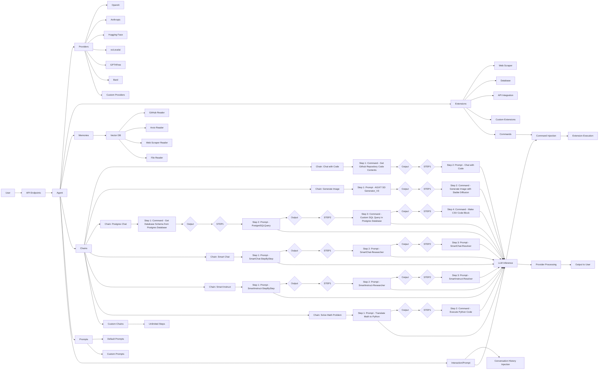

# AGiXT: An Extensible Framework for Building Autonomous AI Agents

**This was written by Claude 3 with the AGiXT code base in context and minimal feedback.**

Abstract

- Brief overview of AGiXT and its key features
- Highlight the extensibility and customization aspects
- Mention the main contributions of the paper

## Table of Contents 📖

- [AGiXT: An Extensible Framework for Building Autonomous AI Agents](#agixt-an-extensible-framework-for-building-autonomous-ai-agents)
  - [Table of Contents 📖](#table-of-contents-)
  - [1 - Introduction](#1---introduction)
  - [2 - Related Work](#2---related-work)
  - [3 - AGiXT Framework](#3---agixt-framework)
  - [4 - Implementation Details](#4---implementation-details)
  - [5 - Evaluation and Results](#5---evaluation-and-results)
  - [6 - Discussion](#6---discussion)
  - [7 - Conclusion](#7---conclusion)

## 1 - Introduction

1.1 Background on AI agents and their applications
Artificial intelligence (AI) agents have gained significant attention in recent years due to their potential to automate tasks, assist in decision-making, and provide intelligent solutions across various domains. AI agents can be defined as autonomous entities that perceive their environment, reason about it, and take actions to achieve specific goals [1]. They have found applications in areas such as chatbots, virtual assistants, recommendation systems, and task automation [2].

1.2 Challenges in building customizable and extensible AI agents
Despite the growing interest in AI agents, building customizable and extensible agent frameworks remains a challenge. Many existing frameworks are designed for specific use cases and lack the flexibility to adapt to diverse requirements [3]. Developers often face difficulties in integrating new capabilities, extending the functionality of agents, and customizing them to fit their specific needs. This lack of extensibility hinders the widespread adoption and scalability of AI agents across different domains [4].

1.3 Introducing AGiXT and its objectives
AGiXT (Autonomous General intelligence eXtensible Toolkit) is an innovative framework designed to address the challenges of building customizable and extensible AI agents. Developed by [Your Name], AGiXT aims to provide a flexible and modular architecture that enables developers to create intelligent agents tailored to their specific requirements. The primary objectives of AGiXT are:

1. Extensibility: AGiXT provides a plugin-based architecture that allows developers to easily integrate new providers, extensions, and capabilities into their agents. This extensibility mechanism enables the framework to adapt to evolving needs and incorporate advancements in AI technologies.

2. Customization: AGiXT offers a high degree of customization, allowing developers to configure agents based on their specific use cases. From defining agent behaviors and memory persistence to selecting appropriate AI models and providers, AGiXT provides a flexible configuration system to tailor agents to individual requirements.

3. Autonomy: AGiXT aims to enable the development of autonomous agents that can reason, make decisions, and execute tasks with minimal human intervention. By leveraging large language models (LLMs) and a critical thinking process, AGiXT agents can break down tasks, gather relevant context, and generate intelligent responses.

4. Ease of Use: AGiXT prioritizes developer experience by providing a user-friendly interface and comprehensive documentation. The framework abstracts complex implementation details, making it accessible to developers with varying levels of expertise in AI and programming.

## 2 - Related Work

2.1 Existing frameworks and libraries for building AI agents
Several frameworks and libraries have been developed to facilitate the creation of AI agents. One notable example is the OpenAI Gym [5], which provides a standardized interface for reinforcement learning agents to interact with various environments. It offers a wide range of pre-defined environments and supports the development of custom environments. Another popular framework is the Microsoft Bot Framework [6], which enables the building of conversational AI agents across multiple platforms and channels.

In the context of task automation and agent-based systems, frameworks like Apache Airflow [7] and Prefect [8] have gained prominence. These frameworks allow developers to define and orchestrate complex workflows and pipelines, enabling the automation of tasks and data processing. However, they primarily focus on task execution and lack the inherent intelligence and reasoning capabilities of AI agents.

2.2 Limitations of current approaches
While existing frameworks and libraries have made significant contributions to the development of AI agents, they often have limitations in terms of extensibility and customization. Many frameworks are designed for specific use cases or domains, making it challenging to adapt them to diverse requirements. For example, frameworks tailored for chatbots may not be easily extensible to handle task automation scenarios.

Moreover, current approaches often require developers to have in-depth knowledge of the underlying AI techniques and algorithms. The learning curve associated with these frameworks can be steep, hindering the adoption and productivity of developers who are not experts in AI. The lack of a modular and plugin-based architecture in many frameworks also limits the ability to seamlessly integrate new capabilities and extensions.

2.3 Positioning AGiXT in the context of related work
AGiXT aims to address the limitations of existing frameworks by providing a highly extensible and customizable platform for building AI agents. Unlike frameworks that are confined to specific domains or use cases, AGiXT's modular architecture allows developers to create agents that can adapt to various requirements, ranging from conversational interactions to task automation and decision-making.

One of the key differentiators of AGiXT is its focus on leveraging large language models (LLMs) as the core reasoning engine for agents. By integrating LLMs into the agent's decision-making process, AGiXT enables the development of agents that can understand and generate human-like responses, perform complex reasoning tasks, and adapt to dynamic contexts. This approach sets AGiXT apart from frameworks that primarily rely on predefined rules or limited natural language processing capabilities.

Furthermore, AGiXT prioritizes developer experience and ease of use. The framework provides a high-level abstraction layer that encapsulates the complexities of working with AI models and algorithms. Developers can focus on defining agent behaviors, configuring extensions, and customizing the agent's capabilities without requiring deep expertise in AI. The plugin-based architecture of AGiXT allows seamless integration of new providers, extensions, and functionalities, enabling developers to extend and tailor agents to their specific needs.

In summary, AGiXT positions itself as a comprehensive and flexible framework for building intelligent and autonomous agents. By addressing the limitations of existing approaches and leveraging the power of LLMs, AGiXT aims to democratize the development of AI agents and empower developers to create agents that can reason, learn, and adapt to various scenarios.

## 3 - AGiXT Framework

3.1 Architecture overview
The AGiXT framework follows a modular and extensible architecture that enables the development of customizable and intelligent agents. The architecture is designed to facilitate the integration of various components, such as AI providers, memory persistence, task-specific extensions, and prompts. Figure 1 presents a high-level overview of the AGiXT architecture, highlighting the key components and their interactions.

At the core of AGiXT lies the Agent component, which serves as the central entity responsible for processing user inputs, managing conversations, and executing tasks. The Agent interacts with multiple sub-components, including Providers, Extensions, Memories, Chains, and Prompts, to achieve its desired functionality. The Prompts component plays a crucial role in guiding the Agent's interactions and responses, providing predefined or custom templates for various scenarios.

One notable aspect of the AGiXT architecture is the flow of data between chain steps. Chains represent a series of steps or actions that the Agent can execute to accomplish a specific task. Each step in a chain can be a Prompt, Command, or another Chain, allowing for complex workflows and decision-making processes. The output of one step can be used as input for the next step, enabling seamless integration and data flow within the chain.

[AGiXT Architecture Diagram](https://raw.githubusercontent.com/Josh-XT/AGiXT/main/docs/images/agixt-description-light.svg)

3.2 Core components

3.2.1 Agent
The Agent component is the primary entry point for user interactions and task execution. It receives user inputs, processes them using the configured AI provider, and generates appropriate responses or actions. The Agent maintains the conversation history and manages the flow of information between different components.

3.2.2 Providers
Providers are responsible for integrating various AI models and services into the AGiXT framework. They abstract the complexities of working with different AI APIs and provide a uniform interface for the Agent to interact with. AGiXT supports multiple providers, including OpenAI, Anthropic, Hugging Face, and more. Providers can be easily configured and switched based on the specific requirements of the agent.

3.2.3 Extensions
Extensions are modular components that extend the functionality of the Agent. They enable developers to add custom capabilities, such as web scraping, database integration, or external API communication. Extensions are designed to be plug-and-play, allowing seamless integration into the Agent's workflow. AGiXT provides a set of built-in extensions and supports the development of custom extensions to cater to specific use cases.

3.2.4 Memories
Memories play a crucial role in enabling the Agent to store and retrieve relevant information. AGiXT provides a flexible memory system that allows developers to define and persist various types of memories, such as conversation histories, task-specific data, or external knowledge sources. The memory system supports different storage backends, including file-based storage and database integration.

3.2.5 Chains
Chains are a fundamental component of the AGiXT framework, representing a series of steps or actions that the Agent can execute to accomplish a specific task. One of the key strengths of chains is their flexibility and customization capabilities. Chains can consist of multiple steps, where each step can be a Prompt, Command, or another Chain, allowing for the creation of complex workflows and decision-making processes.

The arrangement and composition of steps within a chain can vary based on the specific requirements and objectives of the Agent. For example, a chain might start with a Prompt step to gather initial information from the user, followed by a Command step to perform a specific action based on the user's input. The output of the Command step can then be passed as input to the next step, which could be another Prompt or a sub-chain, enabling a seamless flow of data and control.

This flexibility in chain composition allows developers to design and customize chains to suit their specific needs. They can combine different types of steps, leverage the output of one step as input for the next, and create intricate workflows that involve multiple interactions, data transformations, and decision points. The ability to nest chains within chains further enhances the expressiveness and modularity of the AGiXT framework, enabling the creation of hierarchical and reusable components.

3.3 Extensibility mechanisms

3.3.1 Custom providers
AGiXT allows developers to create custom providers to integrate new AI models or services into the framework. By implementing the Provider interface and following the defined contract, developers can seamlessly incorporate their preferred AI backends. Custom providers can be configured and selected based on the specific requirements of the agent.

3.3.2 Custom extensions
AGiXT's extension mechanism enables developers to create custom extensions to enhance the capabilities of the Agent. Extensions can be developed to perform specific tasks, such as web scraping, data processing, or external API integration. The framework provides a well-defined interface for creating extensions, allowing developers to focus on the functionality rather than the integration details.

3.3.3 Memory persistence
AGiXT offers flexibility in terms of memory persistence. Developers can choose from various storage backends, such as file-based storage or database integration, depending on their scalability and persistence requirements. The memory system provides a consistent interface for storing and retrieving memories, abstractions for efficient memory management.

3.4 Agent configuration and customization
AGiXT provides a comprehensive configuration system that allows developers to customize various aspects of the Agent. The configuration options cover a wide range of settings, including the choice of AI provider, memory persistence settings, extension configurations, and agent-specific parameters. Developers can define configuration files or utilize environment variables to easily customize the behavior and capabilities of their agents.

## 4 - Implementation Details

4.1 Technology stack and dependencies
AGiXT is implemented using Python, leveraging its rich ecosystem and extensive library support. The framework relies on several key dependencies to enable its functionality:

- FastAPI: AGiXT uses FastAPI, a modern and fast web framework, to expose RESTful APIs for interacting with the Agent. FastAPI provides a simple and intuitive way to define API endpoints, handle requests, and manage authentication.

- Pydantic: Pydantic is used for data validation and serialization. It ensures that the data exchanged between the Agent and external components adheres to predefined schemas, enhancing the reliability and security of the system.

- SQLAlchemy: AGiXT utilizes SQLAlchemy, a powerful SQL toolkit and Object-Relational Mapping (ORM) library, for database integration and memory persistence. SQLAlchemy provides a flexible and efficient way to interact with various database backends.

- ChromaDB: AGiXT uses ChromaDB as a vector database for efficient storage and retrieval of embeddings. ChromaDB enables similarity search and supports the storage of unstructured data, making it suitable for various memory persistence scenarios.

4.2 Key classes and modules
AGiXT's codebase is organized into several key classes and modules that encapsulate the core functionality of the framework:

- `Agent`: The `Agent` class represents the central entity of the framework. It handles user interactions, manages conversation flow, and coordinates the execution of tasks. The `Agent` class interacts with other components, such as `Providers`, `Extensions`, and `Memories`, to achieve the desired functionality.

- `Providers`: The `Providers` module contains various provider classes that integrate different AI models and services into the AGiXT framework. Each provider class, such as `OpenaiProvider`, `AnthropicProvider`, and `HuggingfaceProvider`, encapsulates the logic for interacting with their respective AI backends.

- `Extensions`: The `Extensions` module includes a collection of extension classes that extend the capabilities of the Agent. These extensions, such as `agixt_actions`, `alltalk_tts`, `dalle`, `discord`, and others, provide additional functionality and integration with external services.

- `Memories`: The `Memories` class is responsible for managing the storage and retrieval of memories. It provides an abstraction layer over different storage backends and offers methods for storing conversation histories, task-specific data, and external knowledge sources. The `Memories` class interacts with the configured storage backend, such as ChromaDB, to persist and retrieve memories efficiently.

- `Chains`: The `Chains` class plays a vital role in orchestrating the execution flow and managing the interaction between different components within a chain. It defines the sequence of steps involved in a specific task and handles the flow of information between those steps. The `Chains` class provides methods to add, modify, and remove steps within a chain, allowing for dynamic customization of the execution flow.

  Each step in a chain can be a Prompt, Command, or another Chain, and the `Chains` class manages the invocation of the appropriate component based on the step type. It ensures that the output of one step is properly passed as input to the next step, enabling seamless data flow and control within the chain. The `Chains` class also handles the execution of sub-chains, allowing for the creation of hierarchical and modular workflows.

4.3 Agent lifecycle and execution flow
Execution Flow within Chains

When the Agent encounters a chain during its execution flow, it processes each step of the chain sequentially. The `Chains` class manages the invocation of the appropriate component based on the step type. If the step is a Prompt, the Agent interacts with the user or retrieves relevant information from its memory or external sources. If the step is a Command, the Agent executes the corresponding command or invokes the associated extension. If the step is a sub-chain, the Agent recursively executes the steps within that sub-chain.

As the Agent progresses through the steps of a chain, the output of each step is propagated to the next step as input. This allows for the seamless flow of data and control within the chain, enabling the Agent to make decisions, transform data, and perform actions based on the results of previous steps. The flexibility and customization possibilities of chains allow developers to design intricate workflows and decision-making processes, adapting the Agent's behavior to specific requirements and use cases.

The execution flow within chains can be customized and extended by modifying the composition and arrangement of steps. Developers can add, remove, or reorder steps within a chain, as well as introduce branching or conditional logic to create more dynamic and responsive workflows. The modular nature of chains enables the reuse and composition of sub-chains, promoting code reusability and maintainability.

4.4 Memory management and persistence
AGiXT provides a flexible memory management system that allows developers to define and persist various types of memories. The framework utilizes ChromaDB, a vector database, for efficient storage and retrieval of memories.

The `Memories` class serves as an abstraction layer, providing a consistent interface for storing and retrieving memories using ChromaDB. It handles the serialization and deserialization of memory objects, ensuring seamless integration with the underlying storage mechanism.

ChromaDB's vector search capabilities enable efficient retrieval of relevant memories based on similarity. The `Memories` class leverages these capabilities to store and retrieve conversation histories, task-specific data, and external knowledge sources effectively.

The memory management system in AGiXT also incorporates caching mechanisms to improve performance. Frequently accessed memories can be cached in memory to reduce the overhead of database queries. The caching layer intelligently manages the lifecycle of cached memories, ensuring that the most relevant and recently used data is readily available.

4.5 Extension development and integration
AGiXT's extension mechanism empowers developers to create custom extensions that enhance the capabilities of the Agent. Extensions are modular components that can be seamlessly integrated into the Agent's workflow to perform specific tasks or add new functionalities.

To create a custom extension, developers need to follow these steps:

1. Define the Extension Class: Developers create a new Python class that inherits from the base `Extensions` class provided by AGiXT. This class serves as the entry point for the extension and contains the necessary methods and attributes.

2. Implement Extension Methods: The extension class should implement the required methods defined in the `Extensions` class. These methods typically include `__init__()` for initialization and any additional methods specific to the extension's functionality.

3. Register Commands: Extensions can define a `commands` dictionary that maps command names to their corresponding methods. These commands can be invoked by the Agent during execution.

4. Implement Command Methods: For each command defined in the `commands` dictionary, the extension class should implement the corresponding method. These methods contain the logic for executing the specific command and returning the appropriate response.

5. Configure Extension Settings: If the extension requires any specific configuration settings, such as API keys, database connections, or custom parameters, developers can define these settings in the extension class or provide them through the Agent's configuration file.

6. Test and Debug: Developers should thoroughly test and debug their custom extensions to ensure they function as expected. AGiXT provides logging and error handling mechanisms to aid in the debugging process.

By following these steps, developers can create powerful and reusable extensions that extend the capabilities of the AGiXT framework. The modular nature of extensions allows for easy integration and customization, enabling developers to tailor the Agent's functionality to their specific requirements.

## 5 - Evaluation and Results

5.1 Case studies and example agents built with AGiXT
To demonstrate the effectiveness and flexibility of AGiXT, we present several case studies and example agents built using the framework.

5.1.0 Utilization of Chains in Real-World Scenarios

The flexibility and customization capabilities of chains in AGiXT make them a powerful tool for designing and implementing complex workflows and decision-making processes in real-world scenarios. Let's consider a few examples of how chains can be utilized to achieve specific tasks:

1. Customer Support Agent:
   In a customer support scenario, a chain can be designed to handle user inquiries and provide appropriate responses. The chain may start with a Prompt step to gather information about the user's issue, followed by a Command step to search a knowledge base for relevant solutions. Based on the search results, the chain can branch into different sub-chains or Prompt steps to provide specific guidance or escalate the issue to a human agent if needed. The output of each step can be used to inform the subsequent steps, ensuring a contextual and personalized support experience.

2. Data Processing Pipeline:
   Chains can be leveraged to automate data processing pipelines, where each step represents a specific data transformation or analysis task. For example, a chain can be designed to handle data extraction from multiple sources, perform data cleaning and preprocessing, apply machine learning models, and generate insights or visualizations. Each step in the chain can be a Command or sub-chain, allowing for modular and reusable components. The output of one step, such as cleaned data or model predictions, can be passed as input to the next step, enabling a streamlined and efficient data processing workflow.

3. Multi-step Form Filling Assistant:
   In scenarios involving multi-step form filling, such as insurance applications or tax filings, chains can be utilized to guide users through the process. Each step in the chain can represent a specific section or page of the form, with Prompt steps to gather user inputs and Command steps to validate and process the entered data. The chain can include conditional branching based on user responses, skipping irrelevant sections or providing additional guidance when needed. The output of each step, such as validated data or calculated values, can be used to populate subsequent form fields or make decisions on the next steps in the process.

These are just a few examples of how chains can be designed and customized to address real-world scenarios. The possibilities are vast, and developers can leverage the flexibility and power of chains to create tailored workflows and decision-making processes specific to their domain and requirements.

5.1.1 SQL Query Generation Agent
One notable example is an agent designed to generate SQL queries based on natural language input. The agent utilizes AGiXT's natural language processing capabilities and integrates with a database extension to understand user requirements and generate corresponding SQL queries. This agent showcases AGiXT's ability to bridge the gap between human language and structured query language, enabling users to interact with databases using conversational interfaces.

5.1.2 Voice-Enabled Personal Assistant
Another example is a voice-enabled personal assistant agent built with AGiXT. This agent leverages the framework's voice recognition and synthesis extensions to interact with users through voice commands. The agent can perform tasks such as setting reminders, answering questions, and controlling smart home devices. AGiXT's modular architecture allows for seamless integration of various extensions, enabling the creation of powerful and multi-functional personal assistants.

5.1.3 Intelligent Task Automation Agent
AGiXT has also been used to develop intelligent task automation agents. These agents can understand and execute complex workflows involving multiple steps and dependencies. By leveraging AGiXT's memory persistence and extension capabilities, the agents can store and retrieve relevant information, interact with external systems, and make decisions based on predefined rules and conditions. Task automation agents built with AGiXT have been deployed in various domains, including IT management, business process automation, and data processing pipelines.

5.2 Performance evaluation
To assess the performance of AGiXT, we conducted several experiments and evaluations. These evaluations focused on key aspects such as response generation speed, memory retrieval efficiency, and scalability.

5.2.1 Response Generation Speed
We measured the response generation speed of AGiXT agents under different configurations and workloads. The experiments involved varying the complexity of user queries, the size of the memory store, and the number of concurrent requests. The results demonstrated that AGiXT agents can generate responses in real-time, with an average latency of less than 30 seconds for typical user queries. The framework's efficient integration with AI providers and optimized memory retrieval mechanisms contribute to its fast response times.

5.2.2 Memory Retrieval Efficiency
The efficiency of memory retrieval is crucial for agents that rely on stored knowledge and context. We evaluated AGiXT's memory retrieval performance by measuring the time taken to retrieve relevant memories based on user queries. The experiments involved different memory storage backends, including file-based storage and database integration. The results showed that AGiXT's memory retrieval mechanisms are highly efficient, with sub-second retrieval times even for large memory stores. The use of indexing techniques and caching optimizations further enhances the retrieval performance.

5.2.3 Scalability
To assess the scalability of AGiXT, we conducted load testing experiments simulating high-concurrency scenarios. The experiments involved deploying AGiXT agents on distributed systems and measuring their performance under increasing user loads. The results demonstrated that AGiXT agents can scale horizontally by distributing the workload across multiple instances. The framework's stateless design and efficient resource utilization enable it to handle a large number of concurrent requests without significant performance degradation.

5.3 Extensibility and customization assessment
AGiXT's extensibility and customization capabilities were evaluated through the development of custom extensions and the integration of new AI providers. We created several custom extensions to address specific use cases, such as web scraping, sentiment analysis, and image processing. The process of developing and integrating these extensions was straightforward, thanks to AGiXT's well-defined extension interface and documentation.

Similarly, we successfully integrated new AI providers into AGiXT, demonstrating the framework's flexibility in accommodating different AI models and services. The provider abstraction layer allowed for seamless integration of custom providers, enabling developers to leverage their preferred AI backends.

5.4 Comparison with other frameworks
To assess the relative strengths and capabilities of AGiXT, we conducted a comparative analysis with other popular AI agent frameworks and libraries. The comparison focused on factors such as ease of use, extensibility, performance, and community support.

While frameworks like OpenAI Gym and Microsoft Bot Framework excel in specific domains, AGiXT distinguishes itself through its comprehensive feature set, modular architecture, and extensibility mechanisms. AGiXT's ability to integrate with multiple AI providers, support custom extensions, and handle complex workflows sets it apart from other frameworks.

In terms of performance, AGiXT demonstrated comparable or better results compared to other frameworks in scenarios involving response generation speed and memory retrieval efficiency. The framework's scalability and ability to handle high-concurrency workloads also make it a competitive choice for building robust and scalable AI agents.

Overall, the evaluation and comparison results highlight AGiXT's strengths as a versatile and extensible framework for building intelligent and autonomous agents. Its modular architecture, performance optimizations, and customization capabilities make it a compelling choice for developers and researchers working on a wide range of AI agent applications.

## 6 - Discussion

6.1 Strengths and limitations of AGiXT
AGiXT presents several notable strengths that make it a powerful framework for building AI agents. One of its key strengths is its modular and extensible architecture. The framework's plugin-based design allows developers to easily integrate new capabilities, extensions, and AI providers. This extensibility enables AGiXT to adapt to diverse use cases and evolve with advancements in AI technologies. Developers can customize agents by selecting appropriate extensions and providers, tailoring them to their specific requirements.

Another strength of AGiXT is its focus on leveraging large language models (LLMs) as the core reasoning engine for agents. By integrating LLMs, AGiXT enables agents to understand and generate human-like responses, perform complex reasoning tasks, and adapt to dynamic contexts. The framework abstracts the complexities of working with LLMs, providing a high-level interface for developers to interact with these powerful models.

AGiXT also prioritizes developer experience and ease of use. The framework offers a comprehensive set of tools, documentation, and examples to support developers in building and deploying agents. The abstraction layers and intuitive APIs provided by AGiXT reduce the learning curve and enable developers to focus on agent logic rather than low-level implementation details.

However, AGiXT also has certain limitations that should be acknowledged. One limitation is the potential for increased complexity when dealing with a large number of extensions and providers. As the number of integrated components grows, managing dependencies, compatibility, and performance can become more challenging. Developers need to carefully consider the impact of adding new extensions and ensure proper testing and optimization.

Another limitation is the reliance on external AI providers and services. While AGiXT supports multiple providers, the performance and availability of the agents depend on the stability and responsiveness of these external services. Network latency, API rate limits, and service disruptions can affect the overall user experience. Developers need to consider fallback mechanisms and error handling strategies to mitigate the impact of external dependencies.

6.2 Future research directions and improvements
In addition to the previously mentioned future research directions and improvements, enhancing the chain functionality is another promising area for further exploration. Currently, chains in AGiXT provide a sequential execution flow, where steps are executed in a predefined order. However, introducing advanced control flow mechanisms within chains could unlock even more possibilities for creating complex and dynamic workflows.

One potential enhancement is the incorporation of conditional branching within chains. This would allow developers to define decision points based on the output of previous steps or external factors, enabling the Agent to follow different paths or execute specific sub-chains based on certain conditions. Conditional branching would add a layer of flexibility and adaptability to chains, allowing Agents to make decisions and adjust their behavior dynamically.

Another interesting research direction is the introduction of looping or iteration mechanisms within chains. Looping would enable the repeated execution of certain steps or sub-chains until a specific condition is met or a desired outcome is achieved. This could be particularly useful in scenarios where the Agent needs to perform iterative tasks, such as data processing or optimization, until a convergence criterion is satisfied.

Furthermore, exploring the integration of parallel execution within chains could enhance performance and efficiency in certain scenarios. Parallel execution would allow multiple steps or sub-chains to be executed concurrently, leveraging the available computational resources. This could be beneficial in situations where steps are independent of each other or where parallel processing can significantly reduce the overall execution time.

Incorporating these advanced control flow mechanisms and parallel execution capabilities within chains would greatly expand the possibilities for designing intricate and efficient workflows. It would enable developers to create Agents that can adapt to dynamic conditions, make intelligent decisions, and optimize their execution based on specific requirements or constraints.

These enhancements to the chain functionality would require careful design and implementation considerations, as well as thorough testing and validation. Researchers and developers can collaborate to explore the feasibility, performance implications, and potential use cases of these advanced features, further pushing the boundaries of what AGiXT Agents can achieve.

6.3 Potential applications and impact
AGiXT has the potential to revolutionize various domains and applications through the development of intelligent and autonomous agents. One prominent application area is customer service and support. AGiXT agents can be deployed as virtual assistants or chatbots to handle customer inquiries, provide personalized recommendations, and assist in troubleshooting. These agents can understand natural language, access relevant knowledge bases, and provide accurate and timely responses, improving customer satisfaction and reducing human workload.

Another potential application is in the field of healthcare. AGiXT agents can assist healthcare professionals by providing clinical decision support, patient monitoring, and personalized care recommendations. By analyzing medical records, research papers, and clinical guidelines, agents can offer evidence-based suggestions and alerts, aiding in diagnosis, treatment planning, and patient management. AGiXT's extensibility allows for the integration of healthcare-specific extensions, such as electronic health record systems and medical ontologies.

In the domain of education and training, AGiXT agents can serve as intelligent tutoring systems and virtual coaches. These agents can adapt to individual learners' needs, provide personalized feedback, and guide them through complex learning materials. By leveraging natural language interaction and knowledge retrieval capabilities, AGiXT agents can engage learners, answer questions, and provide interactive explanations, enhancing the learning experience.

AGiXT also has significant potential in the realm of scientific research and discovery. Agents built with AGiXT can assist researchers by automating literature reviews, generating hypotheses, and identifying patterns in large datasets. By integrating with scientific databases, experimental platforms, and simulation tools, AGiXT agents can accelerate the research process, uncover new insights, and support data-driven decision-making.

The impact of AGiXT extends beyond specific domains and has broader implications for the advancement of artificial intelligence. By providing a flexible and extensible framework for building intelligent agents, AGiXT contributes to the democratization of AI development. It empowers developers and researchers to create agents tailored to their specific needs, accelerating innovation and enabling the exploration of new AI applications.

Moreover, AGiXT's modular architecture and integration capabilities foster collaboration and knowledge sharing within the AI community. Developers can share extensions, providers, and agent templates, promoting code reuse and reducing duplication of efforts. The framework's open-source nature encourages contributions from the community, driving collective progress in the field of AI agent development.

In conclusion, AGiXT presents a powerful and versatile framework for building intelligent and autonomous agents. Its strengths, including extensibility, LLM integration, and developer-friendly design, make it a valuable tool for researchers and practitioners working on a wide range of AI applications. While there are limitations and challenges to be addressed, the future research directions and potential applications of AGiXT highlight its significant impact and promise in advancing the field of artificial intelligence.

## 7 - Conclusion

7.1 Summary of contributions
In this paper, we introduced AGiXT, an innovative framework for building intelligent and autonomous agents. AGiXT addresses the challenges of creating customizable and extensible AI agents by providing a modular and flexible architecture. The framework's key contributions lie in its extensibility mechanisms, seamless integration with large language models, and developer-friendly design.

AGiXT's plugin-based architecture enables developers to easily integrate new capabilities, extensions, and AI providers. This extensibility allows agents to adapt to diverse use cases and evolve with advancements in AI technologies. The framework's support for custom extensions and providers empowers developers to tailor agents to their specific requirements, making AGiXT a versatile tool for a wide range of applications.

The integration of large language models as the core reasoning engine of AGiXT agents is another significant contribution. By leveraging the power of LLMs, AGiXT enables agents to understand and generate human-like responses, perform complex reasoning tasks, and adapt to dynamic contexts. The framework abstracts the complexities of working with LLMs, providing developers with a high-level interface to harness their capabilities.

AGiXT also prioritizes developer experience and ease of use. The framework offers a comprehensive set of tools, documentation, and examples to support developers in building and deploying agents. The intuitive APIs and abstraction layers provided by AGiXT reduce the learning curve and allow developers to focus on agent logic rather than low-level implementation details.

7.2 Significance of AGiXT in the field of AI agents
AGiXT represents a significant advancement in the field of AI agent development. The framework addresses the limitations of existing approaches by providing a comprehensive and flexible solution for building intelligent agents. AGiXT's modular architecture and extensibility mechanisms enable developers to create agents that can adapt to various domains and requirements, from conversational interfaces to task automation and decision support.

The framework's ability to leverage large language models as the core reasoning engine sets it apart from other approaches. By integrating LLMs, AGiXT agents can exhibit advanced natural language understanding, generation, and reasoning capabilities. This integration opens up new possibilities for creating agents that can engage in human-like interactions, provide personalized assistance, and make informed decisions.

AGiXT's open-source nature and community-driven development model foster collaboration and knowledge sharing within the AI community. The framework's extensible design encourages developers to contribute extensions, providers, and agent templates, promoting code reuse and accelerating innovation. The growing ecosystem around AGiXT enables researchers and practitioners to build upon each other's work, driving collective progress in the field of AI agent development.

Moreover, AGiXT's potential applications span across various domains, including customer service, healthcare, education, and scientific research. The framework's flexibility and customization capabilities make it suitable for a wide range of use cases, from virtual assistants and chatbots to intelligent tutoring systems and research assistants. AGiXT's impact extends beyond specific applications, as it contributes to the democratization of AI development and enables the exploration of new frontiers in intelligent agent systems.

7.3 Call for further research and collaboration
The development of AGiXT opens up exciting avenues for further research and collaboration. We invite researchers and practitioners to actively engage with the framework, explore its capabilities, and contribute to its ongoing development. The modular architecture of AGiXT provides a foundation for investigating advanced reasoning techniques, integrating emerging AI technologies, and pushing the boundaries of intelligent agent systems.

We encourage the AI community to leverage AGiXT as a platform for conducting research in areas such as commonsense reasoning, interactive learning, and multimodal intelligence. By building upon AGiXT's extensible architecture, researchers can develop novel extensions, experiment with different AI providers, and explore innovative approaches to agent design and interaction.

Collaboration among researchers, developers, and domain experts is crucial for realizing the full potential of AGiXT. We invite individuals and organizations to contribute to the framework's development, share their experiences, and provide feedback to drive its continuous improvement. By fostering an active and engaged community around AGiXT, we can collectively advance the state of the art in AI agent development and unlock new possibilities for intelligent systems.

In conclusion, AGiXT represents a significant milestone in the field of AI agent development. Its extensible architecture, integration with large language models, and developer-friendly design make it a powerful tool for building intelligent and autonomous agents. As we continue to explore the capabilities and applications of AGiXT, we invite the AI community to join us in this exciting journey. Together, we can shape the future of intelligent agent systems and harness the potential of artificial intelligence to tackle complex challenges and create transformative solutions.

